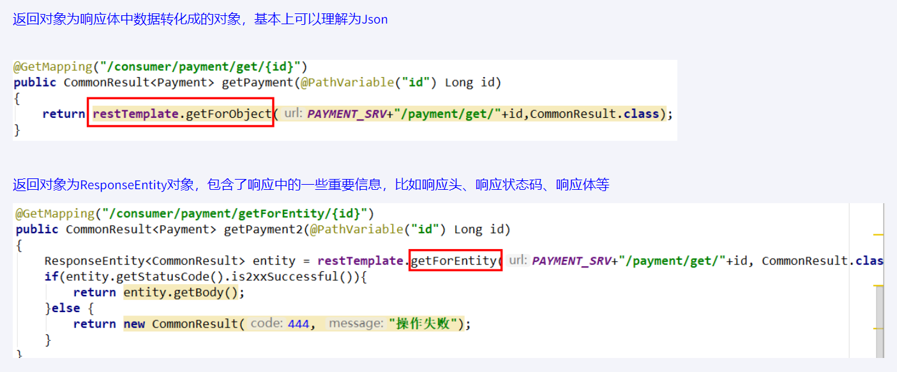
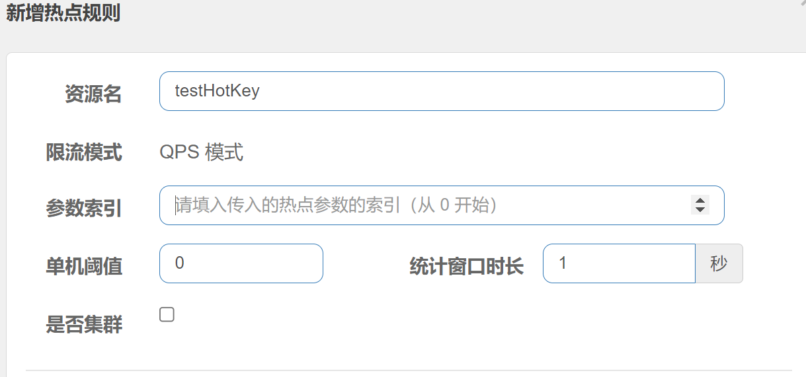
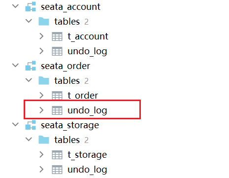
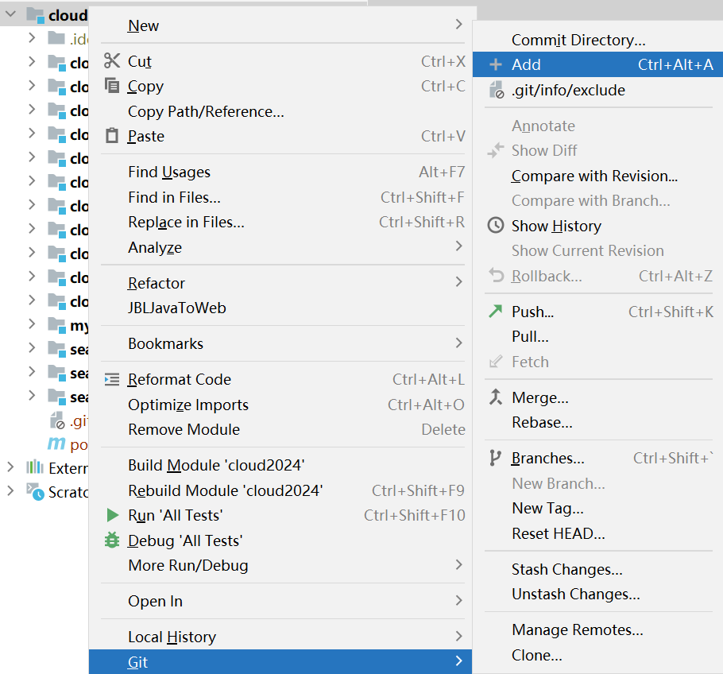

# 版本


# 组件

https://spring.io/projects/spring-cloud


# 微服务架构base工程

## 父工程

### 编码

editor>>file encodings : UTF-8 (ALL)

### 注解生效激活


### 文件过滤

editor>>file types

**pom**

```java
    <properties>
        <maven.compiler.source>17</maven.compiler.source>
        <maven.compiler.target>17</maven.compiler.target>
        <project.build.sourceEncoding>UTF-8</project.build.sourceEncoding>
        <hutool.version>5.8.22</hutool.version>
        <lombok.version>1.18.26</lombok.version>
        <druid.version>1.1.20</druid.version>
        <mybatis.springboot.version>3.0.2</mybatis.springboot.version>
        <mysql.version>8.0.11</mysql.version>
        <swagger3.version>2.2.0</swagger3.version>
        <mapper.version>4.2.3</mapper.version>
        <fastjson2.version>2.0.40</fastjson2.version>
        <persistence-api.version>1.0.2</persistence-api.version>
        <spring.boot.test.version>3.1.5</spring.boot.test.version>
        <spring.boot.version>3.2.0</spring.boot.version>
        <spring.cloud.version>2023.0.0</spring.cloud.version>
        <spring.cloud.alibaba.version>2022.0.0.0-RC2</spring.cloud.alibaba.version>
    </properties>
    <dependencyManagement>
        ***
    <dependencyManagement>
```

> 注意maven setting

- dependencyManagement

> Maven 使用`dependencyManagement` 元素来提供了一种管理依赖版本号的方式。
>
> 通常会在一个组织或者项目的最顶层的父POM 中看到`dependencyManagement` 元素

> 使用pom.xml 中的`dependencyManagement` 元素能让所有在子项目中引用一个依赖而不用显式的列出版本号。
>
> Maven会沿着父子层次向上走，直到找到一个拥有`dependencyManagement` 元素的项目，然后它就会使用这个
>
> `dependencyManagement` 元素中指定的版本号。

​	dependency Management里只是声明依赖，*并不实现引入\*，因此子项目需要显示的声明需要用的依赖。

### maven跳过单元测试


## mapper4

### SQL数据库

db2024

```java
DROP TABLE IF EXISTS `t_pay`;
CREATE TABLE `t_pay` (

  `id` INT(10) UNSIGNED NOT NULL AUTO_INCREMENT,

  `pay_no` VARCHAR(50) NOT NULL COMMENT '支付流水号',

  `order_no` VARCHAR(50) NOT NULL COMMENT '订单流水号',

  `user_id` INT(10) DEFAULT '1' COMMENT '用户账号ID',

  `amount` DECIMAL(8,2) NOT NULL DEFAULT '9.9' COMMENT '交易金额',

  `deleted` TINYINT(4) UNSIGNED NOT NULL DEFAULT '0' COMMENT '删除标志，默认0不删除，1删除',

  `create_time` TIMESTAMP NOT NULL DEFAULT CURRENT_TIMESTAMP COMMENT '创建时间',

  `update_time` TIMESTAMP NOT NULL DEFAULT CURRENT_TIMESTAMP ON UPDATE CURRENT_TIMESTAMP COMMENT '更新时间',

  PRIMARY KEY (`id`)

) ENGINE=INNODB AUTO_INCREMENT=1 DEFAULT CHARSET=utf8mb4 COMMENT='支付交易表';
INSERT INTO t_pay(pay_no,order_no) VALUES('pay17203699','6544bafb424a');
SELECT * FROM t_pay;
```

### 新建module

 "mybatis_generator2024"

pom

```xml
<dependencies>
        <!--Mybatis 通用mapper tk单独使用，自己独有+自带版本号-->
        <dependency>
            <groupId>org.mybatis</groupId>
            <artifactId>mybatis</artifactId>
            <version>3.5.13</version>
        </dependency>
        <!-- Mybatis Generator 自己独有+自带版本号-->
        <dependency>
            <groupId>org.mybatis.generator</groupId>
            <artifactId>mybatis-generator-core</artifactId>
            <version>1.4.2</version>
        </dependency>
        <!--通用Mapper-->
        <dependency>
            <groupId>tk.mybatis</groupId>
            <artifactId>mapper</artifactId>
        </dependency>
        <!--mysql8.0-->
        <dependency>
            <groupId>mysql</groupId>
            <artifactId>mysql-connector-java</artifactId>
        </dependency>
        <!--persistence-->
        <dependency>
            <groupId>javax.persistence</groupId>
            <artifactId>persistence-api</artifactId>
        </dependency>
        <!--hutool-->
        <dependency>
            <groupId>cn.hutool</groupId>
            <artifactId>hutool-all</artifactId>
        </dependency>
        <!--lombok-->
        <dependency>
            <groupId>org.projectlombok</groupId>
            <artifactId>lombok</artifactId>
            <optional>true</optional>
        </dependency>
        <dependency>
            <groupId>org.springframework.boot</groupId>
            <artifactId>spring-boot-starter-test</artifactId>
            <scope>test</scope>
            <exclusions>
                <exclusion>
                    <groupId>org.junit.vintage</groupId>
                    <artifactId>junit-vintage-engine</artifactId>
                </exclusion>
            </exclusions>
        </dependency>
    </dependencies>

    <build>
        <resources>
            <resource>
                <directory>${basedir}/src/main/java</directory>
                <includes>
                    <include>**/*.xml</include>
                </includes>
            </resource>
            <resource>
                <directory>${basedir}/src/main/resources</directory>
            </resource>
        </resources>
        <plugins>
            <plugin>
                <groupId>org.springframework.boot</groupId>
                <artifactId>spring-boot-maven-plugin</artifactId>
                <configuration>
                    <excludes>
                        <exclude>
                            <groupId>org.projectlombok</groupId>
                            <artifactId>lombok</artifactId>
                        </exclude>
                    </excludes>
                </configuration>
            </plugin>
            <plugin>
                <groupId>org.mybatis.generator</groupId>
                <artifactId>mybatis-generator-maven-plugin</artifactId>
                <version>1.4.2</version>
                <configuration>
                    <configurationFile>${basedir}/src/main/resources/generatorConfig.xml</configurationFile>
                    <overwrite>true</overwrite>
                    <verbose>true</verbose>
                </configuration>
                <dependencies>
                    <dependency>
                        <groupId>mysql</groupId>
                        <artifactId>mysql-connector-java</artifactId>
                        <version>8.0.33</version>
                    </dependency>
                    <dependency>
                        <groupId>tk.mybatis</groupId>
                        <artifactId>mapper</artifactId>
                        <version>4.2.3</version>
                    </dependency>
                </dependencies>
            </plugin>
        </plugins>
    </build>
```

src/main/resources下新建

- config.properties

```java
#t_pay表包名
package.name=com.atguigu.cloud

# mysql8.0
jdbc.driverClass = com.mysql.cj.jdbc.Driver
jdbc.url= jdbc:mysql://localhost:3306/db2024?characterEncoding=utf8&useSSL=false&serverTimezone=GMT%2B8&rewriteBatchedStatements=true&allowPublicKeyRetrieval=true
jdbc.user = root
jdbc.password =662524
```

- generatorConfig.xml

```xml
<?xml version="1.0" encoding="UTF-8"?>
<!DOCTYPE generatorConfiguration
        PUBLIC "-//mybatis.org//DTD MyBatis Generator Configuration 1.0//EN"
        "http://mybatis.org/dtd/mybatis-generator-config_1_0.dtd">

<generatorConfiguration>
    <properties resource="config.properties"/>

    <context id="Mysql" targetRuntime="MyBatis3Simple" defaultModelType="flat">
        <property name="beginningDelimiter" value="`"/>
        <property name="endingDelimiter" value="`"/>

        <plugin type="tk.mybatis.mapper.generator.MapperPlugin">
            <property name="mappers" value="tk.mybatis.mapper.common.Mapper"/>
            <property name="caseSensitive" value="true"/>
        </plugin>

        <jdbcConnection driverClass="${jdbc.driverClass}"
                        connectionURL="${jdbc.url}"
                        userId="${jdbc.user}"
                        password="${jdbc.password}">
        </jdbcConnection>

        <javaModelGenerator targetPackage="${package.name}.entities" targetProject="src/main/java"/>

        <sqlMapGenerator targetPackage="${package.name}.mapper" targetProject="src/main/java"/>

        <javaClientGenerator targetPackage="${package.name}.mapper" targetProject="src/main/java" type="XMLMAPPER"/>

        <table tableName="t_pay" domainObjectName="Pay">
            <generatedKey column="id" sqlStatement="JDBC"/>
        </table>
    </context>
</generatorConfiguration>
```

### 一键生成

双击插`mybatis-generator:gererate`,一键生成
生成entity+mapper接口+xml实现SQL


## Rest通用base工程

### 1. **工程v1基本框架**

1.1 新建module : cloud-provider-payment8001

1.2 改pom

1.3 写yml

```java
server:
  port: 8001

# ==========applicationName + druid-mysql8 driver===================
spring:
  application:
    name: cloud-payment-service

  datasource:
    type: com.alibaba.druid.pool.DruidDataSource
    driver-class-name: com.mysql.cj.jdbc.Driver
    url: jdbc:mysql://localhost:3306/db2024?characterEncoding=utf8&useSSL=false&serverTimezone=GMT%2B8&rewriteBatchedStatements=true&allowPublicKeyRetrieval=true
    username: root
    password: 662524

# ========================mybatis===================
mybatis:
  mapper-locations: classpath:mapper/*.xml
  type-aliases-package: com.atguigu.cloud.entities
  configuration:
    map-underscore-to-camel-case: true
```

1.4主启动类

```java
@SpringBootApplication
@MapperScan("com.atguigu.cloud.mapper")
public class Main8001 {
    public static void main(String[] args) {
        SpringApplication.run(Main8001.class);
    }
}
```

### 2. payServiceImpl

```java
@Resource
private PayMapper payMapper;
@Override
public int add(Pay pay) {
    return payMapper.insertSelective(pay);
}
@Override
public int delete(Integer id) {
    return payMapper.deleteByPrimaryKey(id);
}
@Override
public int update(Pay pay) {
    return payMapper.updateByPrimaryKeySelective(pay);
}
@Override
public Pay getById(Integer id) {
    return payMapper.selectByPrimaryKey(id);
}
@Override
public List<Pay> getAll() {
    return payMapper.selectAll();
}
```

### 3. Swagger3


配置类

```java
public class Swagger3config {
    @Bean
    public GroupedOpenApi PayApi(){
        return GroupedOpenApi.builder().group("支付微服务模块").pathsToMatch("/pay/**").build();
    }
    @Bean
    public GroupedOpenApi OtherApi(){
        return GroupedOpenApi.builder().group("其它微服务模块").pathsToMatch("/other/**","/others").build();
    }
    @Bean
    public OpenAPI docsOpenApi()
    {
        return new OpenAPI()
                .info(new Info().title("cloud2024")
                        .description("通用设计rest")
                        .version("v1.0"))
                .externalDocs(new ExternalDocumentation()
                        .description("www.atguigu.com")
                        .url("https://yiyan.baidu.com/"));
    }
}
```

访问http://localhost:8001/swagger-ui/index.html

### 4. payController

```java
@Resource
private PayService payService;

@PostMapping(value="/pay/add")
@Operation(summary = "新增",description = "新增支付流水方法,json串做参数")
public String addPay(@RequestBody Pay pay ){
    int i = payService.add(pay);
    return "addPay:"+i;
}

@DeleteMapping(value="/pay/del/{id}")
@Operation(summary = "删除",description = "删除支付流水方法")
public Integer deletePay(@PathVariable("id") Integer id){
    return payService.delete(id);
}

@PutMapping("/pay/update")
@Operation(summary = "修改",description = "修改支付流水方法")
public String updatePay(@RequestBody PayDTO payDTO){
    Pay pay = new Pay();
    BeanUtil.copyProperties(payDTO,pay);
    int i = payService.update(pay);
    return "updatePay:"+i;
}

@GetMapping("/pay/get/{id}")
@Operation(summary = "按照ID查流水",description = "查询单条支付流水方法")
public Pay getById(@PathVariable("id") Integer id){
    return payService.getById(id);
}

@GetMapping("/pay/getAll")
@Operation(summary = "查所有流水",description = "查询所有支付流水方法")
public List<Pay> getAll(){
    return payService.getAll();
}
```

### 5. 工程v2改进

1. 时间格式统一

bean

```java
@Column(name = "update_time")
@JsonFormat(pattern = "yyyy-MM-dd HH:mm:ss", timezone = "GMT+8")
private Date updateTime;
```

2. 状态码枚举类

```java
@Getter
public enum ReturnCodeEnum {


    RC999("999", "操作XXX失败"),

    RC200("200", "success"),

    RC201("201", "服务开启降级保护,请稍后再试!"),

    RC202("202", "热点参数限流,请稍后再试!"),

    RC203("203", "系统规则不满足要求,请稍后再试!"),

    RC204("204", "授权规则不通过,请稍后再试!"),

    RC403("403", "无访问权限,请联系管理员授予权限"),

    RC401("401", "匿名用户访问无权限资源时的异常"),
    RC404("404", "404页面找不到的异常"),
 
    RC500("500", "系统异常，请稍后重试"),
    RC375("375", "数学运算异常，请稍后重试"),

    INVALID_TOKEN("2001", "访问令牌不合法"),
    ACCESS_DENIED("2003", "没有权限访问该资源"),
    CLIENT_AUTHENTICATION_FAILED("1001", "客户端认证失败"),
    USERNAME_OR_PASSWORD_ERROR("1002", "用户名或密码错误"),
    BUSINESS_ERROR("1004", "业务逻辑异常"),
    UNSUPPORTED_GRANT_TYPE("1003", "不支持的认证模式");

    private final String code;
    private final String message;

    ReturnCodeEnum(String code, String message) {
        this.code = code;
        this.message = message;
    }

    // 常规遍历枚举v1
    public static ReturnCodeEnum getReturnCodeEnumV1(String code){
        for (ReturnCodeEnum value : ReturnCodeEnum.values()) {
            if(value.getCode().equalsIgnoreCase(code)){
                return value;
            }
        }
        return null;
    }

    // Stream遍历枚举v2
    public static ReturnCodeEnum getReturnCodeEnumV2(String code){
        return Arrays.stream(ReturnCodeEnum.values()).filter(x -> x.getCode().equalsIgnoreCase(code)).findFirst().orElse(null);
    }
}
```

3. 返回对象包装

```java
public class ReturnData<T> {

    private String code;
    private String message;
    private T data;
    private long timestamp; //接口调用时间

    public ReturnData() {
        this.timestamp = System.currentTimeMillis();
    }

    public static <T> ReturnData<T> success(T data){
        ReturnData<T> returnData = new ReturnData<T>();
        returnData.setCode(ReturnCodeEnum.RC200.getCode());
        returnData.setMessage(ReturnCodeEnum.RC200.getMessage());
        returnData.setData(data);
        return returnData;
    }

    public static <T> ReturnData<T> fail(String code, String message){
        ReturnData<T> returnData = new ReturnData<T>();
        returnData.setCode(code);
        returnData.setMessage(message);
        return returnData;
    }
}
```

4.全局异常处理器

```java
@Slf4j
@RestControllerAdvice
public class GlobalExceptionHandler {

    @ExceptionHandler(RuntimeException.class)
    @ResponseStatus(HttpStatus.INTERNAL_SERVER_ERROR)
    public ReturnData<String> exception(Exception e){
        log.error("exception{}",e.getMessage(),e);
        return ReturnData.fail(ReturnCodeEnum.RC500.getCode(), e.getMessage());
    }
}
```

## 微服务调用模块

### 1.创建


### 2.RestTemplate

RestTemplate提供了多种便捷访问远程Http服务的方法， 

是一种简单便捷的访问restful服务模板类，是Spring提供的用于访问Rest服务的客户端模板工具集

> https://docs.spring.io/spring-framework/docs/6.0.11/javadoc-api/org/springframework/web/client/RestTemplate.htm

**`getForObject` 与 `getForEntity` 区别**



添加配置类

> `RestTemplate` 实例会被 Spring 管理，在其他类中可以通过依赖注入来使用这个 `RestTemplate` Bean

```java
@Configuration
public class RestTemplateConfig {
    @Bean
    public RestTemplate restTemplate()
    {
        return new RestTemplate();
    }
}
```

### 3.controller

调用restTemplate

```java
@RestController
public class OrderController {

    public static final String PaymentSrv_URL = "http://localhost:8001";
    @Autowired
    private RestTemplate restTemplate;
    
    
    // 一般情况下，通过浏览器的地址栏输入url，发送的只能是get请求
    
    // 增
    @GetMapping("/consumer/pay/add")
    public ReturnData addOrder(PayDTO payDTO){
        return restTemplate.postForObject(PaymentSrv_URL+"/pay/add",payDTO,ReturnData.class);
    }
    // 删
    @GetMapping("/consumer/pay/del/{id}")
    public ReturnData deletePay(@PathVariable("id") Integer id){
        return restTemplate.postForObject(PaymentSrv_URL+"/pay/del/"+id,id,ReturnData.class);
    }
    // 改
    @GetMapping("/consumer/pay/update")
    public ReturnData updatePay(@RequestBody PayDTO payDTO){
        return restTemplate.postForObject(PaymentSrv_URL+"/pay/update",payDTO,ReturnData.class);
    }
    // 查single
    @GetMapping("/consumer/pay/get/{id}")
    public ReturnData getPayInfo(@PathVariable("id") Integer id){
        return restTemplate.getForObject(PaymentSrv_URL + "/pay/get/"+id, ReturnData.class, id);
    }
    // 查
    @GetMapping("/consumer/pay/getAll")
    public ReturnData getPayInfo(){
        return restTemplate.getForObject(PaymentSrv_URL + "/pay/getAll/", ReturnData.class);
    }
}
```

## 工程重构

### 1. 新建module

cloud-api-commons

对外暴露通用组件：entities，resp ,exp

### 2. install


打包保存至D:\maven-repository\com\atguigu\cloud\cloud-api-commons\1.0-SNAPSHOT\cloud-api-commons-1.0-SNAPSHOT.jar


### 3.其它模块修改

80与8001模块删除各自的组件：entities，resp ,exp

pom文件导入

```xml
<!-- 引入自己定义的api通用包 -->
    <dependency>
    <groupId>com.atguigu.cloud</groupId>
    <artifactId>cloud-api-commons</artifactId>
    <version>1.0-SNAPSHOT</version>
    </dependency>
```

# Consul

https://spring.io/projects/spring-cloud-consul spring 官网

https://www.consul.io/    consul官网


## 1. 安装运行

```java
D:\software\consul_1.19.2_windows_amd64>consul agent -dev
```

访问http://localhost:8500

## 2. 服务注册与发现

80与80001注册进consul

- pom

```java
<!--SpringCloud consul discovery -->
    <dependency>
    <groupId>org.springframework.cloud</groupId>
    <artifactId>spring-cloud-starter-consul-discovery</artifactId>
    </dependency>
```

- yaml

```java
####Spring Cloud Consul for Service Discovery
  cloud:
    consul:
      host: localhost
      port: 8500
      discovery:
        service-name: ${spring.application.name}
```

- 主启动类

添加`@EnableDiscoveryClient`，开启服务发现

- controller

原先`url`改为服务注册中心上的微服务名称

```java
public static final String PaymentSrv_URL = "http://cloud-payment-service";
```

-  RestTemplateConfig

添加@LoadBalanced

```java
public class RestTemplateConfig {
    @Bean
    @LoadBalanced
    public RestTemplate restTemplate(){ return new RestTemplate();}
}
```

- 启动consul 测试


## 3. 三个注册中心异同点

C:Consistency(强一致性)

A:Availability(可用性)

P:Partition tolerance(分区容错性)

> 最多只能同时较好的满足两个。
>
>  CAP理论的核心是：一个分布式系统不可能同时很好的满足一致性，可用性和分区容错性这三个需求，
>
> 因此，根据 CAP 原理将 NoSQL 数据库分成了满足 CA 原则、满足 CP 原则和满足 AP 原则三 大类：
>
> CA - 单点集群，满足一致性，可用性的系统，通常在可扩展性上不太强大。
>
> CP - 满足一致性，分区容忍必的系统，通常性能不是特别高。
>
> AP - 满足可用性，分区容忍性的系统，通常可能对一致性要求低一些。

AP：eureka

CP： zookeeper，consul

## 4. 服务配置与刷新

### 1. **服务配置**

> 微服务意味着要将单体应用中的业务拆分成一个个子服务，每个服务的粒度相对较小，因此系统中会出现大量的服务。由于每个服务都需要必要的配置信息才能运行，所以一套集中式的、动态的配置管理设施是必不可少的。比如某些配置文件中的内容大部分都是相同的，只有个别的配置项不同。就拿数据库配置来说吧，如果每个微服务使用的技术栈都是相同的，则每个微服务中关于数据库的配置几乎都是相同的，有时候主机迁移了，我希望一次修改，处处生效

8001改动

#### 1. POM

```xml
<!--SpringCloud consul config-->
<dependency>
    <groupId>org.springframework.cloud</groupId>
    <artifactId>spring-cloud-starter-consul-config</artifactId>
</dependency>
<dependency>
    <groupId>org.springframework.cloud</groupId>
    <artifactId>spring-cloud-starter-bootstrap</artifactId>
</dependency>
```

#### 2. yaml


applicaiton.yml是用户级的资源配置项

bootstrap.yml是系统级的，优先级更加高

> Spring Cloud会创建一个“Bootstrap Context”，作为Spring应用的`Application Context`的父上下文。初始化的时候，`Bootstrap Context`负责从外部源加载配置属性并解析配置。这两个上下文共享一个从外部获取的`Environment`。
>
> `Bootstrap`属性有高优先级，默认情况下，它们不会被本地配置覆盖。 `Bootstrap context`和`Application Context`有着不同的约定，所以新增了一个`bootstrap.yml`文件，保证`Bootstrap Context`和`Application Context`配置的分离。
>
>  application.yml文件改为bootstrap.yml,这是很关键的或者两者共存
>
> 因为bootstrap.yml是比application.yml先加载的。bootstrap.yml优先级高于application.yml

**bootstrap.yml**

```yml
spring:
  application:
    name: cloud-payment-service
    ####Spring Cloud Consul for Service Discovery
  cloud:
    consul:
      host: localhost
      port: 8500
      discovery:
        service-name: ${spring.application.name}
      config:
        profile-separator: '-' # default value is ","，we update '-'
        format: YAML
```

**application.yml**

增加，去除与**bootstrap.yml**相同的内容

```yml
spring  
    profiles:
        active: dev # 多环境配置加载内容dev/prod,不写就是默认default配置
```

#### 3. 配置key:value

创建文件夹config,在创建3个代表不同环境的文件夹


文件夹中创建文件，key为data


#### 4.效果测试

```java
@GetMapping(value = "/pay/get/info")
private String getInfoByConsul(@Value("${atguigu.info}") String atguiguInfo)
{
    return "atguiguInfo: "+atguiguInfo;
}
```

访问http://localhost:8001/pay/get/info时能够获取到atguigu.info=welcome to dev

### 2. 动态刷新

主启动类添加@RefreshScope

可以修改动态刷新的时间，默认为55s，通常不做修改

```yml
spring:
  cloud:
    consul:
      config:
        watch:
          wait-time: 1
```

## 5. consul持久化

> consul重启后，KV不存在

Consul数据持久化配置并目注册为Windows服务

1. consul安装路径下，新建空文件夹mydata保存数据，新建文件consul_start.bat用于注册为windows服务

2. consul_start.bat内容，管理员权限运行

   ```java
   @echo.服务启动......  
   @echo off  
   @sc create Consul binpath= "D:\devSoft\consul_1.17.0_windows_386\consul.exe agent -server -ui -bind=127.0.0.1 -client=0.0.0.0 -bootstrap-expect  1  -data-dir D:\devSoft\consul_1.17.0_windows_386\mydata   "
   @net start Consul
   @sc config Consul start= AUTO  
   @echo.Consul start is OK......success
   @pause
   ```

   

# LoadBalancer

https://docs.spring.io/spring-cloud-commons/reference/spring-cloud-commons/loadbalancer.html

> loadbalancer本地负载均衡客户端 VS Nginx服务端负载均衡区别
>
> Nginx是服务器负载均衡，客户端所有请求都会交给nginx，然后由nginx实现转发请求，即负载均衡是由服务端实现的。
>
> loadbalancer本地负载均衡，在调用微服务接口时候，会在注册中心上获取注册信息服务列表之后缓存到JVM本地，从而在本地实现RPC远程服务调用技术。

## 1. 负载均衡

负载均衡算法：rest接口第几次请求数 % 服务器集群总数量 = 实际调用服务器位置下标 ，每次服务重启动后rest接口计数从1开始。

> 为了便于使用Spring Cloud LoadBalancer，我们提供了ReactorLoadBalancerExchangeFilterFunction（可与WebClient一起使用）和BlockingLoadBalancerClient（可与RestTemplate和RestClient一起工作）。
>
> - [Spring `RestTemplate` as a LoadBalancer Client](https://docs.spring.io/spring-cloud-commons/reference/spring-cloud-commons/common-abstractions.html#rest-template-loadbalancer-client)

## 2. 案列实操

1. 拷贝8001module作为8002

2. 启动consul，将8001，8002注册进微服务

3. 订单80模块修改新增pom，并注册进consul

   ```xml
   <!--loadbalancer-->
   <dependency>
       <groupId>org.springframework.cloud</groupId>
       <artifactId>spring-cloud-starter-loadbalancer</artifactId>
   </dependency>
   ```

4. 80模块修改controller

   ```java
   @GetMapping(value = "/consumer/pay/get/info")
   private String getInfoByConsul()
   {
       return restTemplate.getForObject(PaymentSrv_URL + "/pay/get/info", String.class);
   }
   ```

5. 对应8001和8002

   ```java
   @Value("${server.port}")
   private String port;
   
   @GetMapping(value = "/pay/get/info")
   private String getInfoByConsul(@Value("${atguigu.info}") String atguiguInfo)
   {
       return "atguiguInfo: "+atguiguInfo+"\t"+"port: "+port;
   }
   ```

6. 测试

   

​	访问http://localhost/consumer/pay/get/info，内容为

​	atguiguInfo: welcome to dev port: 8001

​	atguiguInfo: welcome to dev port: 8002

​	交替，即完成负载均衡

## 3. 算法切换

> 默认情况下使用的ReactiveLoadBalancer实现是RoundRobinLoadBalancer。要切换到不同的实现，无论是针对选定的服务还是所有服务，您都可以使用自定义的LoadBalancer配置机制。
>
> 例如，可以通过@LoadBalancerClient注释传递以下配置，以切换到使用RandomLoadBalancer：
>
> ```java
> public class CustomLoadBalancerConfiguration {
> 
> 	@Bean
> 	ReactorLoadBalancer<ServiceInstance> randomLoadBalancer(Environment environment,
> 			LoadBalancerClientFactory loadBalancerClientFactory) {
> 		String name = environment.getProperty(LoadBalancerClientFactory.PROPERTY_NAME);
> 		return new RandomLoadBalancer(loadBalancerClientFactory
> 				.getLazyProvider(name, ServiceInstanceListSupplier.class),
> 				name);
> 	}
> }
> ```
>
> 

默认


**切换**

修改rest template config

```java
@Configuration
@LoadBalancerClient(value = "cloud-payment-service",configuration = RestTemplateConfig.class)

public class RestTemplateConfig {
    @Bean
    @LoadBalanced
    public RestTemplate restTemplate()
    {
        return new RestTemplate();
    }
    @Bean
    ReactorLoadBalancer<ServiceInstance> randomLoadBalancer(Environment environment,
                                                            LoadBalancerClientFactory loadBalancerClientFactory) {
        String name = environment.getProperty(LoadBalancerClientFactory.PROPERTY_NAME);

        return new RandomLoadBalancer(loadBalancerClientFactory.getLazyProvider(name, ServiceInstanceListSupplier.class), name);
    }
}
```

# OpenFeign

## 1. 概述

feign在消费端使用

服务接口调用

> 前面在使用**SpringCloud LoadBalancer**+RestTemplate时，利用RestTemplate对http请求的封装处理形成了一套模版化的调用方法。但是在实际开发中
>
> 由于对服务依赖的调用可能不止一处，往往一个接口会被多处调用，所以通常都会针对每个微服务自行封装一些客户端类来包装这些依赖服务的调用。所以，OpenFeign在此基础上做了进一步封装，由他来帮助我们定义和实现依赖服务接口的定义。在OpenFeign的实现下，我们只需创建一个接口并使用注解的方式来配置它(在一个微服务接口上面标注一个***@FeignClient\***注解即可)，即可完成对服务提供方的接口绑定，统一对外暴露可以被调用的接口方法，大大简化和降低了调用客户端的开发量，也即由服务提供者给出调用接口清单，消费者直接通过OpenFeign调用即可
>
> OpenFeign同时还集成SpringCloud LoadBalancer
>
> 可以在使用OpenFeign时提供Http客户端的负载均衡，也可以集成阿里巴巴Sentinel来提供熔断、降级等功能。而与SpringCloud LoadBalancer不同的是，通过OpenFeign只需要定义服务绑定接口且以声明式的方法，优雅而简单的实现了服务调用
>
> 


## 2. 使用步骤

架构


只需创建一个Rest接口并在该接口上添加注解@FeignClient即可

1. 新建cloud-consumer-feign-oreder80

2. pom and yaml

   ```xml
   <!--openfeign-->
   <dependency>
       <groupId>org.springframework.cloud</groupId>
       <artifactId>spring-cloud-starter-openfeign</artifactId>
   </dependency>
   ```

   ```yml
   server:
     port: 80
   
   spring:
     application:
       name: cloud-consumer-openfeign-order
     ####Spring Cloud Consul for Service Discovery
     cloud:
       consul:
         host: localhost
         port: 8500
         discovery:
           prefer-ip-address: true #优先使用服务ip进行注册
           service-name: ${spring.application.name}
   ```

3. 主启动类MainOpenFeign80

   ```java
   @SpringBootApplication
   @EnableDiscoveryClient //该注解用于向使用consul为注册中心时注册服务
   @EnableFeignClients//启用feign客户端,定义服务+绑定接口，以声明式的方法优雅而简单的实现服务调用
   public class MainOpenFeign80
   {
       public static void main(String[] args)
       {
           SpringApplication.run(MainOpenFeign80.class,args);
       }
   }
   ```

4. controller

   ```java
   public class OrderController
   {
       @Resource
       private PayFeignApi payFeignApi;
   
       @PostMapping("/feign/pay/add")
       public ReturnData addOrder(@RequestBody PayDTO payDTO)
       {
           System.out.println("第一步：模拟本地addOrder新增订单成功(省略sql操作)，第二步：再开启addPay支付微服务远程调用");
           return payFeignApi.addPay(payDTO);
       }
   
       @GetMapping("/feign/pay/get/{id}")
       public ReturnData getPayInfo(@PathVariable("id") Integer id)
       {
           System.out.println("-------支付微服务远程调用，按照id查询订单支付流水信息");
           return payFeignApi.getPayInfo(id);
       }
   
       /**
        * openfeign天然支持负载均衡演示
        */
       @GetMapping(value = "/feign/pay/mylb")
       public String mylb()
       {
           return payFeignApi.mylb();
       }
   
   ```

   

5. api-common

   订单模块要去调用支付模块，订单和支付两个微服务，需要通过Api接口解耦，一般不要在订单模块写非订单相关的业务，

   自己的业务自己做+其它模块走FeignApi接口调用

   1. 引入feign

      ```xml
      <!--openfeign-->
      <dependency>
          <groupId>org.springframework.cloud</groupId>
          <artifactId>spring-cloud-starter-openfeign</artifactId>
      </dependency>
      ```

   2. 新建接口PayFeignApi

      ```java
      @FeignClient(value = "cloud-payment-service")
      public interface PayFeignApi {
          /**
           * 新增一条支付相关流水记录
           * @param payDTO
           * @return
           */
          @PostMapping("/pay/add")
          public ReturnData addPay(@RequestBody PayDTO payDTO);
      
          /**
           * 按照主键记录查询支付流水信息
           * @param id
           * @return
           */
          @GetMapping("/pay/get/{id}")
          public ReturnData getPayInfo(@PathVariable("id") Integer id);
      
          /**
           * openfeign天然支持负载均衡演示
           * @return
           */
          @GetMapping(value = "/pay/get/info")
          public String mylb();
      }
      ```

      

## 3. 测试


http://localhost/feign/pay/add新增订单

http://localhost/feign/pay/mylb天然负载均衡


## 4. 超时控制

默认60s

全局配置

```java
spring:
  cloud:
    openfeign:
      client:
        config:
          default:
            #连接超时时间
                      connectTimeout: 3000
            #读取超时时间
                     readTimeout: 3000
```

指定配置

​	指定哪个服务

​	cloud-payment-service为FeignClient（接口+注解）的值

```java
spring:
  cloud:
    openfeign:
      client:
        config:
          cloud-payment-service:
            #连接超时时间
                      connectTimeout: 5000
            #读取超时时间
                      readTimeout: 5000
```

> 发生配置冲突时，指定配置主导

超时测试

提供方


调用方


## 5. 重试机制

默认关闭

开启，添加 FeignConfig配置类，修改Retryer

```java
@Configuration
public class FeignConfig
{
    @Bean
    public Retryer myRetryer()
    {
        //return Retryer.NEVER_RETRY; //Feign默认配置是不走重试策略的

        //最大请求次数为3(1+2)，初始间隔时间为100ms，重试间最大间隔时间为1s
        return new Retryer.Default(100,1,3);
    }
}
```

## 6. 修改httpClient

> OpenFeign中http client如果不做特殊配置，OpenFeign默认使用JDK自带的HttpURLConnection发送HTTP请求，
>
>  默认HttpURLConnection没有连接池、性能和效率比较低，


使用Apache httpclient 5 替换默认的 HttpURLConnection

1. pom

   ```xml
   <!-- httpclient5-->
   <dependency>
       <groupId>org.apache.httpcomponents.client5</groupId>
       <artifactId>httpclient5</artifactId>
       <version>5.3</version>
   </dependency>
   <!-- feign-hc5-->
   <dependency>
       <groupId>io.github.openfeign</groupId>
       <artifactId>feign-hc5</artifactId>
       <version>13.1</version>
   </dependency>
   ```

   2. yaml

   ```yml
   #  Apache HttpClient5 配置开启
   spring:
     cloud:
       openfeign:
         httpclient:
           hc5:
             enabled: true
   ```

## 7. 请求响应压缩

> **对请求和响应进行GZIP压缩**
>
> Spring Cloud OpenFeign支持对请求和响应进行GZIP压缩，以减少通信过程中的性能损耗。
>
> 通过下面的两个参数设置，就能开启请求与相应的压缩功能：
>
> spring.cloud.openfeign.compression.request.enabled=true
>
> spring.cloud.openfeign.compression.response.enabled=true
>
> **细粒度化设置**
>
> 对请求压缩做一些更细致的设置，比如下面的配置内容指定压缩的请求数据类型并设置了请求压缩的大小下限，
>
> 只有超过这个大小的请求才会进行压缩：
>
> spring.cloud.openfeign.compression.request.enabled=true
>
> spring.cloud.openfeign.compression.request.mime-types=text/xml,application/xml,application/json #触发压缩数据类型
>
> spring.cloud.openfeign.compression.request.min-request-size=2048 #最小触发压缩的大小

可通过日志验证是否压缩


## 8. 日志打印

> NONE：默认的，不显示任何日志；
>
> BASIC：仅记录请求方法、URL、响应状态码及执行时间；
>
> HEADERS：除了 BASIC 中定义的信息之外，还有请求和响应的头信息；
>
> FULL：除了 HEADERS 中定义的信息之外，还有请求和响应的正文及元数据。

修改日志级别

1. 配置日志bean

   ```java
   public class FeignConfig{
       @Bean
       public Retryer myRetryer(){
           return Retryer.NEVER_RETRY; 
       }
   
       @Bean
       Logger.Level feignLoggerLevel() {
           return Logger.Level.FULL;
       }
   }
   ```

2. 配置文件

   ​	Feign logging only responds to the DEBUG level.

   ```yaml
   # feign日志以什么级别监控哪个接口（含有@FeignClient注解的完整带包名的接口名
   logging:
     level:
       com:
         atguigu:
           cloud:
             apis:
               PayFeignApi: debug 
   ```

   

# CircuitBreaker

> 问题：
>
> 禁止服务雪崩故障
>
> 
>
> 解决： 
>
> \- 有问题的节点，快速熔断（快速返回失败处理或者返回默认兜底数据【服务降级】）。
>
> “断路器”本身是一种开关装置，当某个服务单元发生故障之后，通过断路器的故障监控（类似熔断保险丝），向调用方返回一个符合预期的、可处理的备选响应(FallBack)，而不是长时间的等待或者抛出调用方无法处理的异常，这样就保证了服务调用方的线程不会被长时间、不必要地占用，从而避免了故障在分布式系统中的蔓延，乃至雪崩。


**Circuit Breaker只是一套规范和接口，落地实现者是Resilience4J**

> https://github.com/resilience4i/resilience4i#1-introduction
>
> https://github.com/lmhmhl/Resilience4j-Guides-Chinese/blob/main/core-modules/CircuitBreaker.md

## 1. 熔断降级

circuit Breaker

1. 三大状态


2. 配置参数

   https://github.com/lmhmhl/Resilience4j-Guides-Chinese/blob/main/core-modules/CircuitBreaker.md

   | **failure-rate-threshold**                       | **以百分比配置失败率峰值**                                   |
   | ------------------------------------------------ | ------------------------------------------------------------ |
   | **sliding-window-type**                          | **断路器的滑动窗口期类型 可以基于“次数”（COUNT_BASED）或者“时间”（TIME_BASED）进行熔断，默认是COUNT_BASED。** |
   | **sliding-window-size**                          | **若COUNT_BASED，则10次调用中有50%失败（即5次）打开熔断断路器；若为TIME_BASED则，此时还有额外的两个设置属性，含义为：在N秒内（sliding-window-size）100%（slow-call-rate-threshold）的请求超过N秒（slow-call-duration-threshold）打开断路器。** |
   | **slowCallRateThreshold**                        | **以百分比的方式配置，断路器把调用时间大于slowCallDurationThreshold的调用视为慢调用，当慢调用比例大于等于峰值时，断路器开启，并进入服务降级。** |
   | **slowCallDurationThreshold**                    | **配置调用时间的峰值，高于该峰值的视为慢调用。**             |
   | **permitted-number-of-calls-in-half-open-state** | **运行断路器在HALF_OPEN状态下时进行N次调用，如果故障或慢速调用仍然高于阈值，断路器再次进入打开状态。** |
   | **minimum-number-of-calls**                      | **在每个滑动窗口期样本数，配置断路器计算错误率或者慢调用率的最小调用数。比如设置为5意味着，在计算故障率之前，必须至少调用5次。如果只记录了4次，即使4次都失败了，断路器也不会进入到打开状态。** |
   | **wait-duration-in-open-state**                  | **从OPEN到HALF_OPEN状态需要等待的时间**                      |

3. 计数滑动窗口

   80导入依赖

   ```java
   <!--resilience4j-circuitbreaker-->
   <dependency>
       <groupId>org.springframework.cloud</groupId>
       <artifactId>spring-cloud-starter-circuitbreaker-resilience4j</artifactId>
   </dependency>
   <!-- 由于断路保护等需要AOP实现，所以必须导入AOP包 -->
   <dependency>
       <groupId>org.springframework.boot</groupId>
       <artifactId>spring-boot-starter-aop</artifactId>
   </dependency>
   ```

   80配置文件

   ```yml
   # 开启circuitbreaker和分组激活 spring.cloud.openfeign.circuitbreaker.enabled
       circuitbreaker:
   		enabled: true
       	group:
   			enabled: true #没开分组永远不用分组的配置。精确优先、分组次之(开了分组)、默认最后
   ```

   ```yml
   # Resilience4j CircuitBreaker 按照次数：COUNT_BASED 的例子
   #  6次访问中当执行方法的失败率达到50%时CircuitBreaker将进入开启OPEN状态(保险丝跳闸断电)拒绝所有请求。
   #  等待5秒后，CircuitBreaker 将自动从开启OPEN状态过渡到半开HALF_OPEN状态，允许一些请求通过以测试服务是否恢复正常。
   #  如还是异常CircuitBreaker 将重新进入开启OPEN状态；如正常将进入关闭CLOSE闭合状态恢复正常处理请求。
   resilience4j:
     circuitbreaker:
       configs:
         default:
           failureRateThreshold: 50 
           #设置50%的调用失败时打开断路器，超过失败请求百分⽐CircuitBreaker变为OPEN状态。
           slidingWindowType: COUNT_BASED 
           # 滑动窗口的类型
           slidingWindowSize: 6 
           #滑动窗⼝的⼤⼩配置COUNT_BASED表示6个请求，配置TIME_BASED表示6秒
           minimumNumberOfCalls: 6 
           #断路器计算失败率或慢调用率之前所需的最小样本(每个滑动窗口周期)。如果minimumNumberOfCalls为10，则必须最少记		  录10个样本，然后才能计算失败率。如果只记录了9次调用，即使所有9次调用都失败，断路器也不会开启。
           automaticTransitionFromOpenToHalfOpenEnabled: true 
           # 是否启用自动从开启状态过渡到半开状态，默认值为true。如果启用，CircuitBreaker将自动从开启状态过渡到半开状			态，并允许一些请求通过以测试服务是否恢复正常
           waitDurationInOpenState: 5s
           #从OPEN到HALF_OPEN状态需要等待的时间
           permittedNumberOfCallsInHalfOpenState: 2 
           #半开状态允许的最大请求数，默认值为10。在半开状态下，CircuitBreaker将允许最多permittedNumberOfCall 			sInHalfOpenState个请求通过，如果其中有任何一个请求失败，CircuitBreaker将重新进入开启状态。
           recordExceptions:
             - java.lang.Exception
       instances:
         cloud-payment-service:
           baseConfig: default
   ```

   controller

   ```java
   @GetMapping(value = "/feign/pay/circuit/{id}")
   @CircuitBreaker(name = "cloud-payment-service", fallbackMethod = "myCircuitFallback")
   public String myCircuitBreaker(@PathVariable("id") Integer id) {
       return payFeignApi.myCircuit(id);
   }
   public String myCircuitFallback(Integer id,Throwable t) {
       // 这里是容错处理逻辑，返回备用结果
       return "myCircuitFallback，系统繁忙，请稍后再试-----/(ㄒoㄒ)/~~";
   }
   ```

2. 时间滑动窗口

   ```yml
   # Resilience4j CircuitBreaker 按照时间：TIME_BASED 的例子
   resilience4j:
     timelimiter:
       configs:
         default:
           timeout-duration: 10s 
           #神坑的位置，timelimiter 默认限制远程1s，超于1s就超时异常，配置了降级，就走降级逻辑
     circuitbreaker:
       configs:
         default:
           failureRateThreshold: 50
           #设置50%的调用失败时打开断路器，超过失败请求百分⽐CircuitBreaker变为OPEN状态。
           slowCallDurationThreshold: 2s 
           #慢调用时间阈值，高于这个阈值的视为慢调用并增加慢调用比例。
           slowCallRateThreshold: 30 
           #慢调用百分比峰值，断路器把调用时间⼤于slowCallDurationThreshold，视为慢调用，当慢调用比例高于阈值，断路器		  打开，并开启服务降级
           slidingWindowType: TIME_BASED
           # 滑动窗口的类型
           slidingWindowSize: 2 
           #滑动窗口的大小配置，配置TIME_BASED表示2秒
           minimumNumberOfCalls: 2 
           #断路器计算失败率或慢调用率之前所需的最小样本(每个滑动窗口周期)。
           permittedNumberOfCallsInHalfOpenState: 2 
           #半开状态允许的最大请求数，默认值为10。
           waitDurationInOpenState: 5s 
           #从OPEN到HALF_OPEN状态需要等待的时间
           recordExceptions:
             - java.lang.Exception
       instances:
         cloud-payment-service:
           baseConfig: default 
   ```

## 2. 隔离

BulkHead

Resilience4j提供了两种隔离的实现方式，可以限制并发执行的数量。

- `SemaphoreBulkhead`使用了信号量
- `FixedThreadPoolBulkhead`使用了有界队列和固定大小线程池

`SemaphoreBulkhead`可以在各种线程和I/O模型上正常工作。

```xml
<!--resilience4j-bulkhead-->
<dependency>
    <groupId>io.github.resilience4j</groupId>
    <artifactId>resilience4j-bulkhead</artifactId>
</dependency>
```


### 2.1 SemaphoreBulkhead

**信号量舱壁**

> 原理
>
> 当信号量有空闲时，进入系统的请求会直接获取信号量并开始业务处理。
>
> 当信号量全被占用时，接下来的请求将会进入阻塞状态，SemaphoreBulkhead提供了一个阻塞计时器，
>
> 如果阻塞状态的请求在阻塞计时内无法获取到信号量则系统会拒绝这些请求。
>
> 若请求在阻塞计时内获取到了信号量，那将直接获取信号量并执行相应的业务处理。

配置文件

```yml
####resilience4j bulkhead 的例子
resilience4j:
  bulkhead:
    configs:
      default:
        maxConcurrentCalls: 2 # 隔离允许并发线程执行的最大数量
        maxWaitDuration: 1s # 当达到并发调用数量时，新的线程的阻塞时间，我只愿意等待1秒，过时不候进舱壁兜底fallback
    instances:
      cloud-payment-service:
        baseConfig: default
  timelimiter:
    configs:
      default:
        timeout-duration: 20s
```

**controller**

```java
@GetMapping(value = "/feign/pay/bulkhead/{id}")
@Bulkhead(name="cloud-payment—service",fallbackMethod="myBulkheadFallback",type=Bulkhead.Type.SEMAPHORE)
public String myBulkhead(@PathVariable("id") Integer id){
	return payFeignApi.myBulkhead(id);
}
public String myBulkheadFallback(Throwable t){
	return "myBulkheadFallback，隔板超出最大数量限制，系统繁忙，请稍后再试-----/(ㄒoㄒ)/~~";
}
```

测试

http://localhost/feign/pay/bulkhead/9999

http://localhost/feign/pay/bulkhead/1

### 2.2 FixedThreadPoolBulkhead

**固定线程池舱壁**

> FixedThreadPoolBulkhead的功能与SemaphoreBulkhead一样也是**用于限制并发执行的次数**的，但是二者的实现原理存在差别而且表现效果也存在细微的差别。FixedThreadPoolBulkhead使用一个固定线程池和一个等待队列来实现舱壁。
>
> 当线程池中存在空闲时，则此时进入系统的请求将直接进入线程池开启新线程或使用空闲线程来处理请求。
>
> 当线程池中无空闲时时，接下来的请求将进入等待队列，
>
>   若等待队列仍然无剩余空间时接下来的请求将直接被拒绝，
>
>   在队列中的请求等待线程池出现空闲时，将进入线程池进行业务处理。
>
> 另外：ThreadPoolBulkhead只对CompletableFuture方法有效，所以我们必创建返回CompletableFuture类型的方法

底层为JUC的ThreadPoolExecutor

配置文件

```yml
####resilience4j bulkhead -THREADPOOL的例子
resilience4j:
  timelimiter:
    configs:
      default:
        timeout-duration: 10s #timelimiter默认限制远程1s，超过报错不好演示效果所以加上10秒
  thread-pool-bulkhead:
    configs:
      default:
        core-thread-pool-size: 1
        max-thread-pool-size: 1
        queue-capacity: 1
    instances:
      cloud-payment-service:
        baseConfig: default
  # spring.cloud.openfeign.circuitbreaker.group.enabled 请设置为false 新启线程和原来主线程脱离
```

80controller

```java
@GetMapping(value = "/feign/pay/bulkhead/{id}")
@Bulkhead(name = "cloud-payment-service",fallbackMethod = "myBulkheadPoolFallback",type = Bulkhead.Type.THREADPOOL)
public CompletableFuture<String> myBulkheadTHREADPOOL(@PathVariable("id") Integer id){
    
    try { TimeUnit.SECONDS.sleep(3); } catch (InterruptedException e) { e.printStackTrace(); }

    return CompletableFuture.supplyAsync(() -> payFeignApi.myBulkhead(id) + "\t" + " Bulkhead.Type.THREADPOOL");
}
public CompletableFuture<String> myBulkheadPoolFallback(Integer id,Throwable t){
    return CompletableFuture.supplyAsync(() -> "Bulkhead.Type.THREADPOOL，系统繁忙，请稍后再试");
}
```

测试

http://localhost/feign/pay/bulkhead/1

http://localhost/feign/pay/bulkhead/2

http://localhost/feign/pay/bulkhead/3

## 3. 限流

RateLimiter

限流算法

1. **令牌桶算法 (Token Bucket)**：
   - 令牌以固定速率生成，桶内存储令牌。
   - 每次请求需要消耗一个令牌，如果没有令牌则请求被拒绝。
   - 可以支持突发流量。
2. **漏桶算法 (Leaky Bucket)**：
   - 请求到达时放入桶中，桶以固定速率漏出。
   - 超过桶容量的请求会被丢弃。
   - 适合平滑输出流量。
   - 缺点：不能使流突发（burst）到端口速率（突发流量）
3. **计数器算法 (Counter-Based)**：
   - 在固定时间窗口内统计请求数量。
   - 一旦请求数量超出预设的限值，则拒绝后续请求。
   - 缺点：临界double
4. **滑动窗口计数 (Sliding Window)**：
   - 动态计算过去一段时间内的请求数，避免了固定窗口的缺陷。
   - 通过维护多个计数器实现更精细的控制。

**默认使用令牌桶算法 (Token Bucket)**

pom

```java
<!--resilience4j-ratelimiter-->
<dependency>
    <groupId>io.github.resilience4j</groupId>
    <artifactId>resilience4j-ratelimiter</artifactId>
</dependency>
```

yml

```yml
####resilience4j ratelimiter 限流的例子
resilience4j:
  ratelimiter:
    configs:
      default:
        limitForPeriod: 2 #在一次刷新周期内，允许执行的最大请求数
        limitRefreshPeriod: 1s # 限流器每隔limitRefreshPeriod刷新一次，将允许处理的最大请求数量重置为limitForPeriod
        timeout-duration: 1 # 线程等待权限的默认等待时间
    instances:
        cloud-payment-service:
          baseConfig: default
```

controller

```java
@GetMapping(value = "/feign/pay/ratelimit/{id}")
@RateLimiter(name = "cloud-payment-service",fallbackMethod = "myRatelimitFallback")
public String myBulkhead(@PathVariable("id") Integer id)
{
    return payFeignApi.myRatelimit(id);
}
public String myRatelimitFallback(Integer id,Throwable t)
{
    return "你被限流了，禁止访问/(ㄒoㄒ)/~~";
}
```

测试：

http://localhost/feign/pay/ratelimit/1

# MicroMeter+ZipKin

**分布式链路追踪**

sleuth被micrometer替代

> 在微服务框架中，一个由客户端发起的请求在后端系统中会经过多个不同的的服务节点调用来协同产生最后的请求结果，每一个前段请求都会形成一条复杂的分布式服务调用链路，链路中的任何一环出现高延时或错误都会引起整个请求最后的失败。

> 在分布式与微服务场景下，我们需要解决如下问题：
>
> 在大规模分布式与微服务集群下，如何实时观测系统的整体调用链路情况。
>
> 在大规模分布式与微服务集群下，如何快速发现并定位到问题。
>
> 在大规模分布式与微服务集群下，如何尽可能精确的判断故障对系统的影响范围与影响程度。
>
> 在大规模分布式与微服务集群下，如何尽可能精确的梳理出服务之间的依赖关系，并判断出服务之间的依赖关系是否合理。
>
> 在大规模分布式与微服务集群下，如何尽可能精确的分析整个系统调用链路的性能与瓶颈点。
>
> 在大规模分布式与微服务集群下，如何尽可能精确的分析系统的存储瓶颈与容量规划。

上述问题就是我们的落地议题答案：

分布式链路追踪技术要解决的问题，分布式链路追踪（Distributed Tracing），就是将一次分布式请求还原成调用链路，进行日志记录，性能监控并将一次分布式请求的调用情况集中展示。比如各个服务节点上的耗时、请求具体到达哪台机器上、每个服务节点的请求状态等等。

## 1. 原理

一条链路通过Trace Id唯一标识，Span标识发起的请求信息，各span通过parent id 关联起来


## 2. zipkin

https://zipkin.io/

> Zipkin是一种分布式链路跟踪系统图形化的工具，Zipkin 是 Twitter 开源的分布式跟踪系统，能够收集微服务运行过程中的实时调用链路信息，并能够将这些调用链路信息展示到Web图形化界面上供开发人员分析，开发人员能够从ZipKin中分析出调用链路中的性能瓶颈，识别出存在问题的应用程序，进而定位问题和解决问题。

运行jar包

```java
D:\software\zipkin>java -jar zipkin-server-3.4.2-exec.jar
```


访问http://127.0.0.1:9411/zipkin/

## 3. 搭建链路监控

micrometer负责数据采样，zipkin负责图形展示

1. 总体父工程pom

   ```java
   <micrometer-tracing.version>1.2.0</micrometer-tracing.version>
   <micrometer-observation.version>1.12.0</micrometer-observation.version>
   <feign-micrometer.version>12.5</feign-micrometer.version>
   <zipkin-reporter-brave.version>2.17.0</zipkin-reporter-brave.version>
   ```

   ```java
   <!--micrometer-tracing-bom导入链路追踪版本中心  1-->
   <dependency>
       <groupId>io.micrometer</groupId>
       <artifactId>micrometer-tracing-bom</artifactId>
       <version>${micrometer-tracing.version}</version>
       <type>pom</type>
       <scope>import</scope>
   </dependency>
   <!--micrometer-tracing指标追踪  2-->
   <dependency>
       <groupId>io.micrometer</groupId>
       <artifactId>micrometer-tracing</artifactId>
       <version>${micrometer-tracing.version}</version>
   </dependency>
   <!--micrometer-tracing-bridge-brave适配zipkin的桥接包 3-->
   <dependency>
       <groupId>io.micrometer</groupId>
       <artifactId>micrometer-tracing-bridge-brave</artifactId>
       <version>${micrometer-tracing.version}</version>
   </dependency>
   <!--micrometer-observation 4-->
   <dependency>
       <groupId>io.micrometer</groupId>
       <artifactId>micrometer-observation</artifactId>
       <version>${micrometer-observation.version}</version>
   </dependency>
   <!--feign-micrometer 5-->
   <dependency>
       <groupId>io.github.openfeign</groupId>
       <artifactId>feign-micrometer</artifactId>
       <version>${feign-micrometer.version}</version>
   </dependency>
   <!--zipkin-reporter-brave 6-->
   <dependency>
       <groupId>io.zipkin.reporter2</groupId>
       <artifactId>zipkin-reporter-brave</artifactId>
       <version>${zipkin-reporter-brave.version}</version>
   </dependency>
   ```

> 

2.配置8001和80

pom文件引入

```xml
<!--micrometer-tracing指标追踪  1-->

<!--micrometer-tracing-bridge-brave适配zipkin的桥接包 2-->

<!--micrometer-observation 3-->

<!--feign-micrometer 4-->

<!--zipkin-reporter-brave 5-->
```

yml

```yml
# ========================zipkin===================
management:
  zipkin:
    tracing:
      endpoint: http://localhost:9411/api/v2/spans
  tracing:
    sampling:
      probability: 1.0 #采样率默认为0.1(0.1就是10次只能有一次被记录下来)，值越大收集越及时。
```

3.测试

访问：http://localhost/feign/pay/micrometer/1

访问：http://127.0.0.1:9411/zipkin/


# GateWay

Spring Cloud Gateway组件的核心是一系列的过滤器，通过这些过滤器可以将客户端发送的请求转发(路由)到对应的微服务。 Spring Cloud Gateway是加在整个微服务最前沿的防火墙和代理器，隐藏微服务结点IP端口信息，从而加强安全保护。Spring Cloud Gateway本身也是一个微服务，**需要注册进服务注册中心**。

https://docs.spring.io/spring-cloud-gateway

**gateway三大核心**


**gateway工作流程**

> 路由转发+断言判断+执行过滤器链路

客户端向 Spring Cloud Gateway 发出请求。然后在 Gateway Handler Mapping 中找到与请求相匹配的路由，将其发送到 Gateway Web Handler。Handler 再通过指定的过滤器链来将请求发送到我们实际的服务执行业务逻辑，然后返回。

过滤器之间用虚线分开是因为过滤器可能会在发送代理请求之前(Pre)或之后(Post)执行业务逻辑。

在“pre”类型的过滤器可以做参数校验、权限校验、流量监控、日志输出、协议转换等;

在“post”类型的过滤器中可以做响应内容、响应头的修改，日志的输出，流量监控等有着非常重要的作用。


## 1. 服务注册

新建module： `cloud-gateway9527`

pom，yml，main

```xml
<!--gateway-->
    <dependency>
    <groupId>org.springframework.cloud</groupId>
    <artifactId>spring-cloud-starter-gateway</artifactId>
    </dependency>
<!--服务注册发现consul discovery,网关也要注册进服务注册中心统一管控-->
    <dependency>
    <groupId>org.springframework.cloud</groupId>
    <artifactId>spring-cloud-starter-consul-discovery</artifactId>
    </dependency>
<!-- 指标监控健康检查的actuator,网关是响应式编程删除掉spring-boot-starter-web dependency-->
    <dependency>
	<groupId>org.springframework.boot</groupId>
	<artifactId>spring-boot-starter-actuator</artifactId>
	</dependency>
```

```yml
server:
  port: 9527

spring:
  application:
    name: cloud-gateway #以微服务注册进consul或nacos服务列表内
  cloud:
    consul: #配置consul地址
      host: localhost
      port: 8500
      discovery:
        prefer-ip-address: true
        service-name: ${spring.application.name}
```

```java
@SpringBootApplication
@EnableDiscoveryClient //服务注册和发现
public class Main9527 {
    public static void main(String[] args){SpringApplication.run(Main9527.class,args);}
}
```

## 2. 路由配置

```yml
spring.cloud:
    gateway:
      routes:
        - id: pay_routh1 #pay_routh1            #路由的ID(类似mysql主键ID)，没有固定规则但要求唯一，建议配合服务名
          uri: http://localhost:8001            #url写死（不推荐）
          uri: lb://cloud-payment-service       #微服务名称动态获取（lb:load balance)
          predicates:
            - Path=/pay/gateway/get/**          #断言，路径相匹配的进行路由

        - id: pay_routh2 #pay_routh2            #路由的ID(类似mysql主键ID)，没有固定规则但要求唯一，建议配合服务名
          uri: lb://cloud-payment-service       #匹配后提供服务的路由地址
          predicates:
            - Path=/pay/gateway/info/**         #断言，路径相匹配的进行路由
```

> 访问http://localhost:9527/pay/gateway/get/1可路由到8001的http://localhost:8001/pay/gateway/get/1

修改接口@FeignClient值

```java
@FeignClient(value = "cloud-gateway")
public interface PayFeignApi
```

> cloud-gateway为网关以微服务注册进consul的名称

## 3. Perdicate

断言（谓词）

https://docs.spring.io/spring-cloud-gateway/reference/spring-cloud-gateway/request-predicates-factories.html

route perdicate factories


### 1. configure predicates

> There are **two ways** to configure predicates and filters: **shortcuts** and **fully expanded arguments**. Most examples below use the shortcut way.
>
> The name and argument names are listed as `code` in the first sentence or two of each section. The arguments are typically listed in the order that are needed for the shortcut configuration.

 **shortcuts**（常用）

```yml
spring:
  cloud:
    gateway:
      routes:
      - id: after_route
        uri: https://example.org
        predicates:
        - Cookie=mycookie,mycookievalue
```

**fully expanded arguments**

```yml
spring:
  cloud:
    gateway:
      routes:
      - id: after_route
        uri: https://example.org
        predicates:
        - name: Cookie
          args:
            name: mycookie
            regexp: mycookievalue
```

### **2. 内置route perdicate**

1.After Route Predicate

> The `After` route predicate factory takes one parameter, a `datetime` (which is a java `ZonedDateTime`)

> ZonedDateTime获取：
>
> ```java
> ZonedDateTime zbj = ZonedDateTime.now();
> //2024-10-11T17:52:33.795001100+08:00[Asia/Shanghai]
> ```

```java
spring:
  cloud:
    gateway:
      routes:
      - id: after_route
        uri: https://example.org
        predicates:
        - After=2024-10-11T17:52:33.795001100+08:00[Asia/Shanghai]
```

2.other Route Predicate

```yml
- Before=2017-01-20T17:42:47.789-07:00[America/Denver]
- Between=2017-01-20T17:42:47.789-07:00[America/Denver], 2017-01-21T17:42:47.789-07:00[America/Denver]
- Cookie=username,yanang
- Header=X-Request-Id, \d+  # 请求头要有X-Request-Id属性并且值为整数的正则表达式
- Host=**.atguigu.com	
- Path=/pay/gateway/info/**         #断言，路径相匹配的进行路由
- Query=username, \d+  # 要有参数名username并且值还要是整数才能路由
- RemoteAddr=192.168.124.1/24 # 外部访问我的IP限制，最大跨度不超过32，目前是1~24它们是 CIDR 表示法。
- Method=GET,POST
```

> 补充：
>
> 请求携带
>
> 1. 原生命令
>
>    ```shell
>    // 不携带
>    C:\Users\yanang> curl http://localhost:9527/pay/gateway/get/1
>    // 携带参数
>    C:\Users\yanang> curl http://localhost:9527/pay/gateway/get/1   --cookie "username=yanang"
>    C:\Users\yanang> curl http://localhost:9527/pay/gateway/get/1    -H  "X-Request-Id:123456"
>    C:\Users\yanang> curl http://localhost:9527/pay/gateway/get/1    -H  "Host:www.atguigu.com"
>    ```
>
> 2. postman
>
> 3. 浏览器
>
>    

### 3. 自定义route perdicate

步骤：

1.新建类名XXX需要以RoutePredicateFactory结尾并继承AbstractRoutePredicateFactory类
2.重写apply方法 
3.新建apply方法所需要的静态内部类MyRoutePredicateFactory.Config这个Config类就是我们的路由断言规则

4.空参构造方法，内部调用super 
5.重写apply方法第二版 

6.shortcutFieldOrder实现，支持 **shortcuts**配置

> 参考AfterRoutePredicateFactory
>
> ```java
> public class AfterRoutePredicateFactory extends AbstractRoutePredicateFactory<Config> {
>     public static final String DATETIME_KEY = "datetime";
> 
>     public AfterRoutePredicateFactory() {super(Config.class);}
> 
>     public List<String> shortcutFieldOrder() {
>         return Collections.singletonList("datetime");
>     }
> 
>     public Predicate<ServerWebExchange> apply(final Config config) {
>         return new GatewayPredicate() {
>             public boolean test(ServerWebExchange serverWebExchange) {
>                 ZonedDateTime now = ZonedDateTime.now();
>                 return now.isAfter(config.getDatetime());
>             }
>         };
>     }
> 
>     public static class Config {
>         private @NotNull ZonedDateTime datetime;
>         public Config() {}
>         public ZonedDateTime getDatetime() {return this.datetime;}
>         public void setDatetime(ZonedDateTime datetime) {this.datetime = datetime;}
>     }
> }
> ```

My Route Predicate

```java
@Component
public class MyRoutePredicateFactory extends AbstractRoutePredicateFactory<MyRoutePredicateFactory.Config> {

    public MyRoutePredicateFactory() {
        super(MyRoutePredicateFactory.Config.class);
    }
	public List<String> shortcutFieldOrder() {
        return Collections.singletonList("userType");
    }
    @Override
    public Predicate<ServerWebExchange> apply(MyRoutePredicateFactory.Config config) {
        return new GatewayPredicate() {
            @Override
            public boolean test(ServerWebExchange serverWebExchange) {
                String userType = serverWebExchange.getRequest().getQueryParams().getFirst("userType");
                if (userType == null) {return false;}
                return userType.equals(config.getUserType());
            }
        };
    }
    @Validated
    public static class Config {
        @NotEmpty @Getter @Setter
        private  String userType;
    }
}
```

yaml：

```yamL
predicates:
	- Path=/pay/gateway/get/**             
	- After=2024-10-11T17:55:33.795001100+08:00[Asia/Shanghai]
	- My=diamond
```

测试：

http://localhost:9527/pay/gateway/get/1?userType=diamond

## 4. Filter

> SpringMVC的拦截器interceptor,servlet的拦截器

作用：

> 请求鉴权，异常处理，**记录接口调用时长统计**

类型

> Global filter
>
> GateWay filter
>
> 自定义 filter

### 1. Gateway 内置过滤器

> https://docs.spring.io/spring-cloud-gateway/reference/spring-cloud-gateway/gatewayfilter-factories.html

请求头相关过滤器

- 增加AddRequestHeader
- 删除RemoveRequestHeader
- 修改SetRequestHeader

请求参数filter

- AddRequestParameter
- RemoveRequestParameter

回应头相关filter

- AddResponseHeader
- SetResponseHeader
- RemoveResponseHeader

路径相关filter

- PrefixPath（ 与-path 搭配）
- SetPath路径设置（ 与-path 搭配）
- RedirectTo重定向（ 与-path 搭配）

```yml
- id: pay_routh3 #pay_routh3
  uri: lb://cloud-payment-service                #匹配后提供服务的路由地址
  predicates:
  	- Path=/pay/gateway/filter/**              # 断言，路径相匹配的进行路由
  filters:
  	- AddRequestHeader=X-Request-atguigu1,atguiguValue1  # 请求头kv，若一头含有多参则重写一行设置
    - AddRequestHeader=X-Request-atguigu2,atguiguValue2
    - RemoveRequestHeader=sec-fetch-site      # 删除请求头sec-fetch-site
    - SetRequestHeader=sec-fetch-mode, Blue-yanang # 将请求头sec-fetch-mode对应的值修改为Blue-yanang
    
    - AddRequestParameter=customerId,9527001 # 新增请求参数Parameter：k ，v
    - RemoveRequestParameter=customerName   # 删除url请求参数customerName，你传递过来也是null
    
    - AddResponseHeader=X-Response-atguigu, BlueResponse # 新增回应参数X-Response-atguigu并设值为Blue
    - SetResponseHeader=Date,2099-11-11 # 设置回应头Date值为2099-11-11
    - RemoveResponseHeader=Content-Type # 将默认自带Content-Type回应属性删除
    
    - PrefixPath=/pay  # http://localhost:9527/pay/gateway/filter
    - SetPath=/pay/gateway/{segment}  # {segment}表示占位符，你写abc也行但要上下一致
    - RedirectTo=302, http://www.atguigu.com/
    # 访问http://localhost:9527/pay/gateway/filter跳转到http://www.atguigu.com/
```

**Default Filters**

> 配置在此处相当于全局通用，global

```java
spring:
  cloud:
    gateway:
      default-filters:
      - AddResponseHeader=X-Response-Default-Red, Default-Blue
      - PrefixPath=/httpbin
```

### 2. 自定义Global filter

> https://docs.spring.io/spring-cloud-gateway/reference/spring-cloud-gateway/global-filters.html

> ```java
> @Bean
> public GlobalFilter customFilter() {
>     return new CustomGlobalFilter();
> }
> 
> public class CustomGlobalFilter implements GlobalFilter, Ordered {
> 
>     @Override
>     public Mono<Void> filter(ServerWebExchange exchange, GatewayFilterChain chain) {
>         log.info("custom global filter");
>         return chain.filter(exchange);
>     }
> 
>     @Override
>     public int getOrder() {
>         return -1;
>     }
> }
> ```

步骤：

- 创建xxxGlobalFilter 实现 GlobalFilter, Ordered

**统计接口耗时**

```java
@Component
@Slf4j
public class MyGlobalFilter implements GlobalFilter, Ordered {

    private static final String BEGIN_VISIT_TIME = "begin_visit_time";//开始访问时间

    @Override
    public Mono<Void> filter(ServerWebExchange exchange, GatewayFilterChain chain) {
        // exchange相当于上下文环境
        exchange.getAttributes().put(BEGIN_VISIT_TIME,System.currentTimeMillis());
        return chain.filter(exchange).then(Mono.fromRunnable(()->{
            Long beginVisitTime = exchange.getAttribute(BEGIN_VISIT_TIME);
            if (beginVisitTime != null) {
                log.info("访问主机："+exchange.getRequest().getURI().getHost());
                log.info("访问端口："+exchange.getRequest().getURI().getPort());
                log.info("访问url："+exchange.getRequest().getURI().getPath());
                log.info("耗时："+(System.currentTimeMillis()-beginVisitTime)+"ms");
                log.info("===================================================");
                System.out.println();
            }
        }));
    }
    @Override
    public int getOrder() {
        return 0;  // 数字越小优先级越高
    }
}
```

> global filter不需要配置yml

### 3.自定义条件filter

参考SetPathGatewayFilterFactory

> ```java
> public class SetPathGatewayFilterFactory extends AbstractGatewayFilterFactory<Config> {
>     public static final String TEMPLATE_KEY = "template";
> 
>     public SetPathGatewayFilterFactory() {super(Config.class);}
> 
>     public List<String> shortcutFieldOrder() {
>         return Arrays.asList("template");
>     }
> 
>     public GatewayFilter apply(final Config config) {
>         final UriTemplate uriTemplate = new UriTemplate(config.template);
>         return new GatewayFilter() {
>             public Mono<Void> filter(ServerWebExchange exchange, GatewayFilterChain chain) {
>                 ServerHttpRequest req = exchange.getRequest();
>                 ServerWebExchangeUtils.addOriginalRequestUrl(exchange, req.getURI());
>                 Map<String, String> uriVariables = ServerWebExchangeUtils.getUriTemplateVariables(exchange);
>                 URI uri = uriTemplate.expand(uriVariables);
>                 String newPath = uri.getRawPath();
>                 exchange.getAttributes().put(ServerWebExchangeUtils.GATEWAY_REQUEST_URL_ATTR, uri);
>                 ServerHttpRequest request = req.mutate().path(newPath).build();
>                 return chain.filter(exchange.mutate().request(request).build());
>             }
>         };
>     }
> 
>     public static class Config {
>         private String template;
>         public Config() {}
>         public String getTemplate() { return this.template;}
>         public void setTemplate(String template) {this.template = template;}
>     }
> }
> ```

步骤

1.新建类名XXX需要以GatewayFilterFactory结尾并继承AbstractGatewayFilterFactory类
2.重写apply方法 
3.新建apply方法所需要的静态内部类Config这个Config类就是我们的路由过滤规则

4.空参构造方法，内部调用super 
5.重写apply方法第二版 

6.shortcutFieldOrder实现，支持 **shortcuts**配置

```java
@Component
public class MyGatewayFilterFactory extends AbstractGatewayFilterFactory<MyGatewayFilterFactory.Config> {

    public MyGatewayFilterFactory(){super(MyGatewayFilterFactory.Config.class);}
    
    @Override
    public GatewayFilter apply(MyGatewayFilterFactory.Config config) {
        return new GatewayFilter() {
            @Override
            public Mono<Void> filter(ServerWebExchange exchange, GatewayFilterChain chain) {
                ServerHttpRequest request = exchange.getRequest();
                String status = config.getStatus();
                if(request.getQueryParams().containsKey(status)){
                    return chain.filter(exchange);
                }else{
                    exchange.getResponse().setStatusCode(HttpStatus.BAD_REQUEST);
                    return exchange.getResponse().setComplete();
                }
            }
        };
    }

    public List<String> shortcutFieldOrder() {return Arrays.asList("status");}

    public static class Config{
        @Getter@Setter
        private String status;//设定一个状态值/标志位，存在才可以访问
    }
}
```

配置：

```yaml
id: pay_routh3 #pay_routh3
uri: lb://cloud-payment-service                #匹配后提供服务的路由地址
predicates:
	- Path=/pay/gateway/filter/**              # 断言，路径相匹配的进行路由
filters:
    - AddRequestHeader=X-Request-atguigu1,atguiguValue1  # 请求头kv，若一头含有多参则重写一行设置
    - My=atguigu
```

测试

http://localhost:9527/pay/gateway/filter?atguigu=22 		success

http://localhost:9527/pay/gateway/filter								fail

# SpringCloudAlibaba

github:https://github.com/alibaba/spring-cloud-alibaba

文档：https://github.com/alibaba/spring-cloud-alibaba/blob/2023.x/README-zh.md

参考：https://sca.aliyun.com/

# Nacos

版本号：2.2.3

https://spring-cloud-alibaba-group.github.io/github-pages/2022/zh-cn/2022.0.0.0-RC2.html

## 1. 安装运行

解压安装包，直接运行bin目录下的startup.cmd -m standalone

运行访问http://localhost:8848/nacos

> 默认账号密码为<nacos,nacos>

关闭：shutdown.cmd

## 2. discovery服务注册

**cloudalibaba-provider-payment9001**

pom:

```java
<!--nacos-discovery-->
    <dependency>
    <groupId>com.alibaba.cloud</groupId>
    <artifactId>spring-cloud-starter-alibaba-nacos-discovery</artifactId>
    </dependency>
```

yml:

```java
server:
  port: 9001

spring:
  application:
    name: nacos-payment-provider
  cloud:
    nacos:
      discovery:
        server-addr: localhost:8848 #配置Nacos地址
```

**cloudalibaba-consumer-nacos-order83**

pom:

```java
	<!--nacos-discovery-->
    <dependency>
    <groupId>com.alibaba.cloud</groupId>
    <artifactId>spring-cloud-starter-alibaba-nacos-discovery</artifactId>
    </dependency>
    <!--loadbalancer-->
    <dependency>
    <groupId>org.springframework.cloud</groupId>
    <artifactId>spring-cloud-starter-loadbalancer</artifactId>
    </dependency>
```

yml:

```java
server:
  port: 83

spring:
  application:
    name: nacos-order-consumer
  cloud:
    nacos:
      discovery:
        server-addr: localhost:8848
#消费者将要去访问的微服务名称(nacos微服务提供者叫什么你写什么)
service-url:
  nacos-user-service: http://nacos-payment-provider
```

**负载均衡**

虚拟端口映射


测试：

访问http://localhost:83/consumer/pay/nacos/1

轮询调用9001，9002

## 3. config服务配置

新建module：cloudalibaba-config-nacos-client3377

pom

```java
	<!--bootstrap-->
    <dependency>
    <groupId>org.springframework.cloud</groupId>
    <artifactId>spring-cloud-starter-bootstrap</artifactId>
    </dependency>
    <!--nacos-config-->
    <dependency>
    <groupId>com.alibaba.cloud</groupId>
    <artifactId>spring-cloud-starter-alibaba-nacos-config</artifactId>
    </dependency>
    <!--nacos-discovery-->
    <dependency>
    <groupId>com.alibaba.cloud</groupId>
    <artifactId>spring-cloud-starter-alibaba-nacos-discovery</artifactId>
    </dependency>
```

bootstrap.yml

```yml
# nacos配置
spring:
  application:
    name: nacos-config-client
  cloud:
    nacos:
      discovery:
        server-addr: localhost:8848 #Nacos服务注册中心地址
      config:
        server-addr: localhost:8848 #Nacos作为配置中心地址
        file-extension: yaml #指定yaml格式的配置

# nacos端配置文件DataId的命名规则是：
# ${spring.application.name}-${spring.profile.active}.${spring.cloud.nacos.config.file-extension}
# 本案例的DataID是:nacos-config-client-dev.yaml
```

application.yml

```yml
server:
  port: 3377

spring:
  profiles:
    active: dev # 表示开发环境
       #active: prod # 表示生产环境
       #active: test # 表示测试环境
```

**添加配置信息**

**Nacos数据模型key**

NameSpace -Group-dataId

- NameSpace命名空间默认为public，可通过spring.cloud.nacos.config.namespace指定
- Group默认为DEFAULT_GROUP，可通过spring.cloud.nacos.config.group指定

> ```yml
> spring:
>   application:
>     name: nacos-config-client
>   cloud:
>     nacos:
>       discovery:
>         server-addr: localhost:8848 #Nacos服务注册中心地址
>       config:
>         server-addr: localhost:8848 #Nacos作为配置中心地址
>         file-extension: yaml #指定yaml格式的配置
>         group: aGroup
>         namespace: public
> ```

**dataId配置规则**


创建配置：


test:

```java
@RestController
@RefreshScope //在控制器类加入@RefreshScope注解使当前类下的配置支持Nacos的动态刷新功能。
public class NacosConfigClientController
{
    @Value("${config.info}")
    private String configInfo;

    @GetMapping("/config/info")
    public String getConfigInfo() {
        return configInfo;
    }
}
```

http://localhost:3377/config/info>>>welcome to public nacos-config-client-dev.yaml ,version=1

> 相比consul,nocos自动持久化和配置回滚，两者皆可动态刷新 

# Sentinel

等价circuitBreaker

版本1.8.6

懒加载，须访问后才可对接口进行限流，降级等操作。

wiki: https://github.com/alibaba/Sentinel/wiki/%E4%BB%8B%E7%BB%8D

Sentinel 由两个组件组成，前台端口8080，后台端口8719

## 1. 启动入门

下载jar包，并运行，访问http://localhost:8080  <username,pswd>=<sentinel,sentinel>

**入门案列**

新建微服务8401

pom:

```xml
<!--SpringCloud alibaba sentinel -->
    <dependency>
    <groupId>com.alibaba.cloud</groupId>
    <artifactId>spring-cloud-starter-alibaba-sentinel</artifactId>
    </dependency>
    <!--nacos-discovery-->
    <dependency>
    <groupId>com.alibaba.cloud</groupId>
    <artifactId>spring-cloud-starter-alibaba-nacos-discovery</artifactId>
    </dependency>
```

yml：

```yml
server:
  port: 8401

spring:
  application:
    name: cloudalibaba-sentinel-service
  cloud:
    nacos:
      discovery:
        server-addr: localhost:8848         #Nacos服务注册中心地址
    sentinel:
      transport:
        dashboard: localhost:8080 #配置Sentinel dashboard控制台服务地址
        port: 8719 #默认8719端口，假如被占用会自动从8719开始依次+1扫描,直至找到未被占用的端口
```

## 2. 流控规则


> | 1资源名   | 资源的唯一名称，默认就是请求的接口路径，可以自行修改，但是要保证唯一。 |
> | --------- | ------------------------------------------------------------ |
> | 2针对来源 | 具体针对某个微服务进行限流，默认值为default，表示不区分来源，全部限流。 |
> | 3阈值类型 | QPS表示通过Queries Per Second进行限流，并发线程数表示通过并发线程数限流。 |

1.**流控模式**

- 直接

  当接口达到限流条件时，直接开启限流功能

- 关联

  当关联的资源达到阈值时，就限流自己

  > 
  >
  > 当访问localhost:8401/testB达到阈值后，testA无法访问

- 链路

  来自不同链路的请求对同一个目标访问时，实施针对性的不同限流措施比如C请求来访问就限流，D请求来访问就是OK

  

  > @SentinelResource
  >
  > ```java
  > @Service
  > public class FlowLimitService{
  >     @SentinelResource(value = "common")
  >     public void common()System.out.println("------FlowLimitService come in");}
  > }
  > ```
  >
  > controller /testC 和 /testD 分别调用service的common方法
  >
  > 
  >
  > C和D两个请求都访问**flowLimitService**.common()方法，对C限流，对D不管

2.流控效果

- 快速失败，抛出Blocked by Sentinel (flow limiting)

- warm up

  预热，冷启动

  默认 coldFactor 为3，即请求 QPS 从 threshold /3 开始，经预热时长逐渐升至设定的 QPS 阈值。

  

  QPS从3开始逐渐升至10

  > 应用：秒杀系统在开启的瞬间，会有很多流量上来，很有可能把系统打死，预热方式就是把为了保护系统，可慢慢的把流量放进来，慢慢的把阈值增长到设置的阈值。

- 排队等待

  按照单机阈值，一秒钟通过一个请求，10秒后的请求作为超时处理，放弃

  

## 3. 熔断规则

1.慢调用比例

在统计时长内，实际请求数目＞设定的最小请求数  且   实际慢调用比例＞比例阈值 ，进入熔断状态，熔断时间结束后进入half-open状态

超过最大RT时间的请求视为**慢调用**


2.异常比例

3.异常数

## 4. @SentinelResource

SentinelResource是一个流量防卫防护组件注解用于指定防护资源，对配置的资源进行流量控制、熔断降级等功能。

- 按资源名称限流

```java
@GetMapping("/rateLimit/byResource")
@SentinelResource(value = "byResourceSentinelResource")
public String byResource(){
        return "按资源名称SentinelResource限流测试OK";
}
```

- 按资源名称限流+自定义限流返回

  注解处指明blockHandler，blockHandler函数参数最好包含调用函数的所有参数，同时携带参数BlockException 

```java
@GetMapping("/rateLimit/byResource")
@SentinelResource(value = "byResourceSentinelResource",blockHandler = "handleException")
public String byResource(@PathVariable("p1") Integer p1){
    return "按资源名称SentinelResource限流测试OK";
}
public String handleException(@PathVariable("p1") Integer p1，BlockException exception){
    return "服务不可用@SentinelResource启动"+"\t"+"o(╥﹏╥)o";
}
```

- 按资源名称限流+自定义限流返回+服务降级处理

  注解处指明fallback，fallback函数参数最好包含调用函数的所有参数，同时携带参数Throwable 

  falback，**程序异常了JVM抛出的异常服务降级**

```java
@GetMapping("/rateLimit/doAction/{p1}")
    @SentinelResource(value = "doActionSentinelResource",
                      blockHandler = "doActionBlockHandler",
                      fallback = "doActionFallback")
    public String doAction(@PathVariable("p1") Integer p1) {
        if (p1 == 0){
            throw new RuntimeException("p1等于零直接异常");
        }
        return "doAction";
    }

    public String doActionBlockHandler(@PathVariable("p1") Integer p1, BlockException e){
        log.error("sentinel配置自定义限流了:{}", e);
        return "sentinel配置自定义限流了";
    }

    public String doActionFallback(@PathVariable("p1") Integer p1,Throwable e){
        log.error("程序逻辑异常了:{}", e);
        return "程序逻辑异常了"+"\t"+e.getMessage();
    }
```

test:

http://localhost:8401/rateLimit/doAction/1 限流控制

http://localhost:8401/rateLimit/doAction/0 falback异常

## 5. 热点规则

热点即经常访问的数据，很多时候我们希望统计或者限制某个热点数据中访问频次最高的TopN数据，并对其访问进行限流或者其它操作

测试：

```java
@GetMapping("/testHotKey")
@SentinelResource(value = "testHotKey",blockHandler = "dealHandler_testHotKey")
public String testHotKey(@RequestParam(value = "p1",required = false) String p1,
                         @RequestParam(value = "p2",required = false) String p2){
    return "------testHotKey";
}
public String dealHandler_testHotKey(String p1,String p2,BlockException exception){
    return "-----dealHandler_testHotKey";
}
```




**参数例外项**


## 6. 授权规则

需要实现：RequestOriginParser

编写MyRequestOriginParser 实现RequestOriginParser用来作为黑白名单的“断言”功能

```java
@Component
public class MyRequestOriginParser implements RequestOriginParser {
    @Override
    public String parseOrigin(HttpServletRequest httpServletRequest) {
        return httpServletRequest.getParameter("serverName");
    }
}
```

配置：


测试


## 7. 规则持久化

通过读取nacos中的config服务配置来实现

pom新增：

```java
<!--SpringCloud ailibaba sentinel-datasource-nacos -->
    <dependency>
    <groupId>com.alibaba.csp</groupId>
    <artifactId>sentinel-datasource-nacos</artifactId>
    </dependency>
```

yml

```yml
server:
  port: 8401

spring:
  application:
    name: cloudalibaba-sentinel-service
  cloud:
    sentinel:
      datasource: #持久化配置
          ds1:	#自定义key，授权规则
          	nacos:
              server-addr: localhost:8848   #nacos地址
              dataId: ${spring.application.name} #nacos的dataId
              groupId: DEFAULT_GROUP #nacos的groupId
              data-type: json #nacos的data-type
              rule-type: flow # 详细见：com.alibaba.cloud.sentinel.datasource.RuleType
              				  # flow流控，degrade熔断，param-flow热点，authority授权
```

在Nacos中创建yml对应配置


> resource：资源名称；
>
> limitApp：来源应用；
>
> grade：阈值类型，0表示线程数，1表示QPS；
>
> count：单机阈值；
>
> strategy：流控模式，0表示直接，1表示关联，2表示链路；
>
> controlBehavior：流控效果，0表示快速失败，1表示Warm Up，2表示排队等待；
>
> clusterMode：是否集群

## 8. 整合OpenFeign

**需求**

cloudalibaba-consumer-nacos-order83  通过OpenFeign调用  cloudalibaba-provider-payment9001

1 83  通过OpenFeign调用 9001微服务，正常访问OK

2 83  通过OpenFeign调用 9001微服务，异常访问error

 	访问者要有fallback服务降级的情况，不要持续访问9001加大微服务负担，但是通过feign接口调用的又方法各自不同，

 如果每个不同方法都加一个fallback配对方法，会导致代码膨胀不好管理，工程埋雷

3 **public** @**interface** FeignClient

 	 通过fallback属性进行统一配置，feign接口里面定义的全部方法都走统一的服务降级，**一个搞定即可**。

4 9001微服务自身还带着sentinel内部配置的流控规则，如果满足也会被触发，也即本例有2个Case

 	4.1 OpenFeign接口的统一fallback服务降级处理
 	
 	4.2 Sentinel访问触发了自定义的限流配置,在注解@SentinelResource里面配置的blockHandler方法。

**9001**

```xml
<!--openfeign-->
    <dependency>
    <groupId>org.springframework.cloud</groupId>
    <artifactId>spring-cloud-starter-openfeign</artifactId>
    </dependency>
<!--alibaba-sentinel-->
    <dependency>
    <groupId>com.alibaba.cloud</groupId>
    <artifactId>spring-cloud-starter-alibaba-sentinel</artifactId>
    </dependency>
```

```java
spring.cloud.sentinel:
      transport:
        dashboard: localhost:8080 #配置Sentinel dashboard控制台服务地址
        port: 8719 #默认8719端口，假如被占用会自动从8719开始依次+1扫描,直至找到未被占用的端口
```

**cloud-api-commons**

- pom同样添加openfeign和alibaba-sentinel

- 新写一个openfeign接口

  nacos-payment-provider为9001的spring.application.name

```java
@FeignClient(value = "nacos-payment-provider",fallback = PayFeignSentinelApiFallBack.class)
public interface PayFeignSentinelApi
{
    @GetMapping("/pay/nacos/get/{orderNo}")
    public ReturnData getPayByOrderNo(@PathVariable("orderNo") String orderNo);
}
```

- PayFeignSentinelApiFallBack (fallback服务降级处理)

```java
@Component
public class PayFeignSentinelApiFallBack implements PayFeignSentinelApi {
    @Override
    public ReturnData getPayByOrderNo(String orderNo) {
        return ReturnData.fail(ReturnCodeEnum.RC500.getCode(), "对方服务宕机或不可用，FallBack服务降级");
    }
}
```

**83**

- pom

  导入cloud-api-commons，openfeign和alibaba-sentinel

- yml

  ```yml
  # 激活Sentinel对Feign的支持
  feign:
    sentinel:
      enabled: true
  ```

- main83

  添加@EnableFeignClients，启动feign功能

- controller

  ```java
  @Resource
  private PayFeignSentinelApi payFeignSentinelApi;
  
  @GetMapping(value = "/consumer/pay/nacos/get/{orderNo}")
  public ReturnData getPayByOrderNo(@PathVariable("orderNo") String orderNo){
      return payFeignSentinelApi.getPayByOrderNo(orderNo);
  }
  ```

**父工程**

版本兼容问题

```java
<spring.boot.version>3.0.9</spring.boot.version>
<spring.cloud.version>2022.0.2</spring.cloud.version>
```

**测试**


## 9. 整合GateWay

新建module: cloudalibaba-sentinel-gateway9528

pom:

```xml
	<dependency>
    <groupId>org.springframework.cloud</groupId>
    <artifactId>spring-cloud-starter-gateway</artifactId>
    </dependency>
    <dependency>
    <groupId>com.alibaba.csp</groupId>
    <artifactId>sentinel-transport-simple-http</artifactId>
    <version>1.8.6</version>
    </dependency>
    <dependency>
    <groupId>com.alibaba.csp</groupId>
    <artifactId>sentinel-spring-cloud-gateway-adapter</artifactId>
    <version>1.8.6</version>
    </dependency>
    <dependency>
    <groupId>javax.annotation</groupId>
    <artifactId>javax.annotation-api</artifactId>
    <version>1.3.2</version>
    <scope>compile</scope>
    </dependency>
```

yml

```yml
server:
  port: 9528

spring:
  application:
    name: cloudalibaba-sentinel-gateway     # sentinel+gataway整合Case
  cloud:
    nacos:
      discovery:
        server-addr: localhost:8848
    gateway:
      routes:
        - id: pay_routh1 #pay_routh1         #路由的ID(类似mysql主键ID)，没有固定规则但要求唯一，建议配合服务名
          uri: http://localhost:9001         #匹配后提供服务的路由地址
          predicates:
          - Path=/pay/**                     # 断言，路径相匹配的进行路由
```

GatewayConfiguration,参照官网

```java
@Configuration
public class GatewayConfiguration {

    private final List<ViewResolver> viewResolvers;
    private final ServerCodecConfigurer serverCodecConfigurer;

    public GatewayConfiguration(ObjectProvider<List<ViewResolver>> viewResolversProvider,
                                ServerCodecConfigurer serverCodecConfigurer)
    {
        this.viewResolvers = viewResolversProvider.getIfAvailable(Collections::emptyList);
        this.serverCodecConfigurer = serverCodecConfigurer;
    }

    @Bean
    @Order(Ordered.HIGHEST_PRECEDENCE)
    public SentinelGatewayBlockExceptionHandler sentinelGatewayBlockExceptionHandler() {
        // Register the block exception handler for Spring Cloud Gateway.
        return new SentinelGatewayBlockExceptionHandler(viewResolvers, serverCodecConfigurer);
    }

    @Bean
    @Order(-1)
    public GlobalFilter sentinelGatewayFilter() {
        return new SentinelGatewayFilter();
    }

    @PostConstruct //javax.annotation.PostConstruct
    public void doInit() {
        initBlockHandler();
    }


    //处理/自定义返回的例外信息
    private void initBlockHandler() {
        Set<GatewayFlowRule> rules = new HashSet<>();
        //自己新增流控规则
        rules.add(new GatewayFlowRule("pay_routh1").setCount(2).setIntervalSec(1));

        GatewayRuleManager.loadRules(rules);
        BlockRequestHandler handler = new BlockRequestHandler() {
            @Override
            public Mono<ServerResponse> handleRequest(ServerWebExchange exchange, Throwable t) {
                Map<String,String> map = new HashMap<>();

                map.put("errorCode", HttpStatus.TOO_MANY_REQUESTS.getReasonPhrase());
                map.put("errorMessage", "请求太过频繁，系统忙不过来，触发限流(sentinel+gataway整合Case)");

                return ServerResponse.status(HttpStatus.TOO_MANY_REQUESTS)
                        .contentType(MediaType.APPLICATION_JSON)
                        .body(BodyInserters.fromValue(map));
            }
        };
        
        GatewayCallbackManager.setBlockHandler(handler);
    }

}
```

# Seata

简介


## 1. 工作流程

**1+3**

- 1个XID

​		事务的唯一标志，它可以在服务的调用链路中传递，绑定到服务的事务上下文中。

- 3个概念

  TC,TM,RM

  

流程：

1. TM 向 TC 申请开启一个全局事务，全局事务创建成功并生成一个全局唯一的 XID；
2. XID 在微服务调用链路的上下文中传播；
3. RM 向 TC 注册分支事务，将其纳入 XID 对应全局事务的管辖；
4. TM 向 TC 发起针对 XID 的全局提交或回滚决议；
5. TC 调度 XID 下管辖的全部分支事务完成提交或回滚请求。

**事务的模式**

 https://seata.apache.org/zh-cn/docs/user/mode/at，简介AT模式

## 2. 安装启动

安装SeaTa2.0.0

1.数据库建库建表seata

```sql
CREATE DATABASE seata;
USE seata;
```

建表SQL语句：https://github.com/apache/incubator-seata/tree/develop/script/server/db/mysql.sql

2.更改配置

备份SeaTa的conf/application.yml

```yml
#  Copyright 1999-2019 Seata.io Group.
#
#  Licensed under the Apache License, Version 2.0 (the "License");
#  you may not use this file except in compliance with the License.
#  You may obtain a copy of the License at
#

#  http://www.apache.org/licenses/LICENSE-2.0

#
#  Unless required by applicable law or agreed to in writing, software
#  distributed under the License is distributed on an "AS IS" BASIS,
#  WITHOUT WARRANTIES OR CONDITIONS OF ANY KIND, either express or implied.
#  See the License for the specific language governing permissions and
#  limitations under the License.

server:
  port: 7091

spring:
  application:
    name: seata-server
        
logging:
  config: classpath:logback-spring.xml
  file:
    path: ${log.home:${user.home}/logs/seata}
  extend:
    logstash-appender:
      destination: 127.0.0.1:4560
    kafka-appender:
      bootstrap-servers: 127.0.0.1:9092
      topic: logback_to_logstash

console:
  user:
    username: seata
    password: seata

seata:
  config:
    type: nacos
    nacos:
      server-addr: 127.0.0.1:8848
      namespace:
      group: SEATA_GROUP #后续自己在nacos里面新建,不想新建SEATA_GROUP，就写DEFAULT_GROUP
      username: nacos
      password: nacos

  registry:
    type: nacos
    nacos:
      application: seata-server
      server-addr: 127.0.0.1:8848
      group: SEATA_GROUP #后续自己在nacos里面新建,不想新建SEATA_GROUP，就写DEFAULT_GROUP
      namespace:
      cluster: default
      username: nacos
      password: nacos    

  store:
    mode: db
    db:
      datasource: druid
      db-type: mysql
      driver-class-name: com.mysql.cj.jdbc.Driver
      url: jdbc:mysql://localhost:3306/seata?characterEncoding=utf8&useSSL=false&serverTimezone=GMT%2B8&rewriteBatchedStatements=true&allowPublicKeyRetrieval=true

      user: root
      password: 662524
      min-conn: 10
      max-conn: 100
      global-table: global_table
      branch-table: branch_table
      lock-table: lock_table
      distributed-lock-table: distributed_lock
      query-limit: 1000
      max-wait: 5000

  #  server:
  #    service-port: 8091 #If not configured, the default is '${server.port} + 1000'
  security:
    secretKey: SeataSecretKey0c382ef121d778043159209298fd40bf3850a017
    tokenValidityInMilliseconds: 1800000
    ignore:
      urls: /,/**/*.css,/**/*.js,/**/*.html,/**/*.map,/**/*.svg,/**/*.png,/**/*.jpeg,/**/*.ico,/api/v1/auth/login,/metadata/v1/**
```

3.启动

cmd:seata-server.bat

访问：http://localhost:7091(端口号，密码写于配置文件)

## 3. 微服务实现

### **1. 数据库准备**

订单，库存，账户

- 数据库

```sql
CREATE DATABASE seata_order;
CREATE DATABASE seata_storage;
CREATE DATABASE seata_account;
```

- undo_log日志回滚表

> AT模式专用

- 业务表

t_order, t_storage, t_account


### **2. 编码实现**

- mapper一键生成

  config.properties

  ```properties
  # seata_order
  #jdbc.driverClass = com.mysql.cj.jdbc.Driver
  #jdbc.url = jdbc:mysql://localhost:3306/seata_order?characterEncoding=utf8&useSSL=false&serverTimezone=GMT%2B8&rewriteBatchedStatements=true&allowPublicKeyRetrieval=true
  #jdbc.user = root
  #jdbc.password =662524
  
  # seata_storage
  #jdbc.driverClass = com.mysql.cj.jdbc.Driver
  #jdbc.url = jdbc:mysql://localhost:3306/seata_storage?characterEncoding=utf8&useSSL=false&serverTimezone=GMT%2B8&rewriteBatchedStatements=true&allowPublicKeyRetrieval=true
  #jdbc.user = root
  #jdbc.password =662524
  
  # seata_account
  #jdbc.driverClass = com.mysql.cj.jdbc.Driver
  #jdbc.url = jdbc:mysql://localhost:3306/seata_account?characterEncoding=utf8&useSSL=false&serverTimezone=GMT%2B8&rewriteBatchedStatements=true&allowPublicKeyRetrieval=true
  #jdbc.user = root
  #jdbc.password =662524
  ```

  generatorConfig.xml

  ```xml
  	<!--  seata_order -->
      <!--<table tableName="t_order" domainObjectName="Order">
      <generatedKey column="id" sqlStatement="JDBC"/>
      </table>-->
  
      <!--seata_storage-->
      <!--<table tableName="t_storage" domainObjectName="Storage">
      <generatedKey column="id" sqlStatement="JDBC"/>
      </table>-->
  
      <!--seata_account-->
      <!--<table tableName="t_account" domainObjectName="Account">
      <generatedKey column="id" sqlStatement="JDBC"/>
      </table>-->
  ```

  补充：生成的mapper,可以添加@Tostring 和实现Serializable接口

  ```java
  @ToString
  public class Order implements Serializable 
  ```

  

- cloud-api-common新增两个接口

  ```java
  @FeignClient(value = "seata-storage-service")
  public interface StorageFeignApi
  {
      /*** 扣减库存 */
      @PostMapping(value = "/storage/decrease")
      ResultData decrease(@RequestParam("productId") Long productId, @RequestParam("count") Integer count);
  }
  ```

  ```java
  @FeignClient(value = "seata-account-service")
  public interface AccountFeignApi
  {
      //扣减账户余额
      @PostMapping("/account/decrease")
      ResultData decrease(@RequestParam("userId") Long userId, @RequestParam("money") Long money);
  }
  ```

- 订单微服务

  seata-order-service2001

  pom,yal,主启动，业务类（controller,service)

- 库存微服务

  seata-storage-service2002

  pom,yal,主启动，业务类（controller,service)

  生成的StorageMapper补充方法

  ```java
  void decrease(@Param("productId") Long productId, @Param("count") Integer count);
  ```

  对应的StorageMapper.xml补充

  ```xml
  <update id="decrease">
      UPDATE
        t_storage
      SET
        used = used + #{count},
        residue = residue - #{count}
      WHERE product_id = #{productId}
    </update>
  ```

- 账户微服务

  seata-account-service2003

  pom,yal,主启动，业务类（controller,service)

  AccountMapper补充自定义方法

  ```java
  void decrease(@Param("userId") Long userId, @Param("money") Long money);
  ```

  对应的AccountMapper.xml

  ```xml
  <update id="decrease">
      UPDATE
        t_account
      SET
        residue = residue - #{money},used = used + #{money}
      WHERE user_id = #{userId};
    </update>
  ```


### 3.  测试

springboot，springcloud与Seata不兼容

降低springboot，springcloud版本

父工程pom处：

```xml
<!--仅为了整合openfeign + alibaba seata的案例，降低版本处理下-->
<spring.boot.version>3.1.7</spring.boot.version>
<spring.cloud.version>2022.0.4</spring.cloud.version>
```

测试接口：http://localhost:2001/order/create?userId=1&productId=1&count=10&money=100

不添加分布式锁的情况下，出现异常错误不会回滚事务

**添加分布式锁**：

在OrderServiceImpl的create方法添加注解

```java
@GlobalTransactional(name = "yang-create-order",rollbackFor = Exception.class) //AT
```

Seata中：


### 4. 原理

AT模式两阶段提交模式：

在一阶段，Seata 会拦截“业务 SQL”，

1 解析 SQL 语义，找到“业务 SQL”要更新的业务数据，在业务数据被更新前，将其保存成“before image”，

2 执行“业务 SQL”更新业务数据，在业务数据更新之后，

3 其保存成“after image”，最后生成行锁。

以上操作全部在一个数据库事务内完成，这样保证了一阶段操作的原子性。

二阶段如是顺利提交的话，

因为“业务 SQL”在一阶段已经提交至数据库，所以Seata框架只需将一阶段保存的快照数据和行锁删掉，完成数据清理即可。

二阶段回滚：

二阶段如果是回滚的话，Seata 就需要回滚一阶段已经执行的“业务 SQL”，还原业务数据。

回滚方式便是用“before image”还原业务数据；但在还原前要首先要校验脏写，对比“数据库当前业务数据”和 “after image”，

如果两份数据完全一致就说明没有脏写，可以还原业务数据，如果不一致就说明有脏写，出现脏写就需要转人工处理。

> 具体的快照数据保存在对应的undo_log中
>
> 

# 总结

上传至github

1. VCS -Create git repository

2. add

   

3. GIT-commit Directory

4. share

   

5.pull
